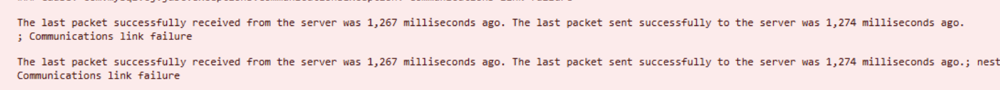
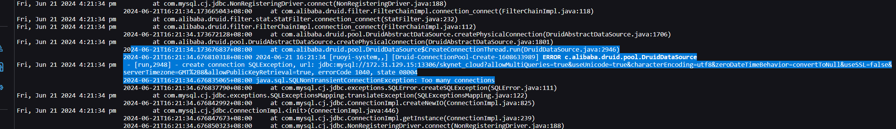

- 今天处理了一次 [[MySQL]] [[数据库]] [[连接池]] 的 [[故障]]，记录一下
	- 首先提一下架构，客户端是druid连接池，数据库是 [[MySQL]]，，然后中间用  HAProxy  做了下主备（以前一直以为是多主，搞笑了）。
	- 先说结论——**HAProxy的超时配置问题，导致其自顾自地把连接关闭了**（或者做了某种负载均衡，让端口漂移了之类的），而**客户端和数据库均不知道其关闭了**，这就导致：
		- 客户端不知道连接被关闭了，然后使用该连接时报连接失败，客户端便丢弃该连接，创建新连接
		  logseq.order-list-type:: number
		- MySQL不知道连接被关闭了，结果数据库中有大量时间很长的状态为`Sleep`的连接
		  logseq.order-list-type:: number
		- 连接数量不断增加，直到达到数据库的连接数量上限 `max_connections`，后续再创建连接便会报错`Too many connections`，彻底停摆。
		  logseq.order-list-type:: number
	- 最后问题仍未解决，配置HAProxy（我没参与所以不清楚细节）的超时时间后状况似乎有缓解，但仍旧马上又出问题。最终无果只得丢弃HAProxy，直连数据库，此后问题消失，后续考虑换掉HAProxy。这非常玄学，之前从来没出现过这问题。
	- ---
	- 首先遇到的问题是前端反应慢，然后控制台有报错弹出来：
		- 
		- 这个错误是说，**客户端到数据库的连接关闭了，而客户端以为该连接未关闭**，同时这里展示了上一次发送和收到包的时间。
	- 然后，系统开始变得无法访问：
		- 
	- 中途解决问题时，有以下过程：
		- 出现问题时是下午四点半，为了保证系统正常运行，不断调大`max_connections`，重启了一些服务，但还是导致了十多分钟系统无法响应，属于是重大事故了，要写故障报告。后来把预发布环境停掉，重启数据库（因为是主备所以……似乎问题还好），暂且是扛到晚上十点，这时候因为已经没有用户了，所以没啥问题，但晚上临睡前一看连接数仍在缓慢地涨起来
		- 首先怀疑是一处异步调用的地方的问题，一个异步操作中取调用了一个外部API去设置一个值然后插入到数据库，但该API在生产时无法访问，结果每次调用时都会卡住直到超时（tmd 60秒，YBB），同时这里用的是 [[Spring]] 自己的异步线程池，**据说丫的每次异步调用时都会创建一个新线程**（YBB！！！），然后怀疑是否这里创建了太多线程一直在运行，这些线程会占住连接不放之类的。把这里的代码注释掉后重发版本，未见改善。
			- 按理说这没啥道理，我一个普普通通的线程池里的线程，为啥和连接有关系？即使真的可能有关系，那也得是tomcat的nio线程吧？但这里确实是个问题，后面要改成自己实现一个线程池替换掉这个弱智操作。
		- 然后怀疑有人攻击，试图检查连接者是否有异常，然后发现k8s代理把这玩意掩盖掉了，看不到实际连接者，无果，后续尝试直接进入节点机器去看`netstat`，结果发现自己不会看hhhhh，妈的linux的内置命令还是得学学。
		-
	-