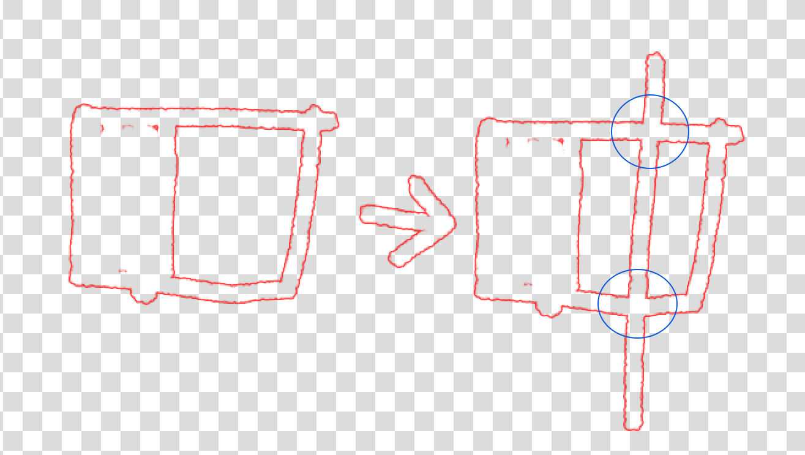
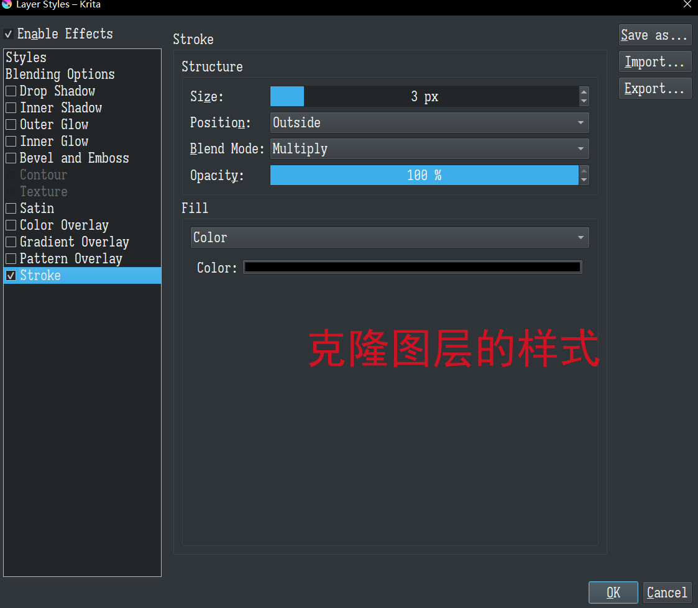

- [[Krita]] 中两种模拟中空笔刷的 [[trick]]
	- 中空笔刷即中间是空的，只有边缘有着色的笔刷。中空笔刷需要有这样的特性，即在再次绘制到已经绘制的区域时已经被笔触包围的区域不会再变化。
	- 
	- Krita对此没有直接支持，但摸索出两种方式去支持它，一种是利用图层样式，一种是利用画笔选项，前者更通用，任何笔刷都可用，造成各种各样的丰富描边，但无法做“抽象“，而且性能可能稍差，而且只能通过样式去控制描边颜色；后者能将细节隐藏到笔刷中，但需要专门的笔刷图像，可操控性差，无法调节描边宽度。考虑有需要还是更多地用前者。
	- # 1. 利用克隆图层+图层描边样式
		- 假设要描边的图层为A，该方法的思路是`(A+描边) - A`，即创建A的克隆图层，设置样式为描边stroke，颜色为纯黑，并设置其混合模式为 erase；在其上创建一个图层开启继承不透明度，混合模式设置为lighten用来控制颜色；这些图层置于同一个图层组中以控制影响范围。
		- 这里，如果中间需要设置为透明色，克隆图层模式就设置为erase；如果要设置为纯白色，设置为XNOR；如果要设置为任意色……那直接用描边样式就行了！这就是描边样式本来的用途。
		- ps：
			- 混合模式为erase就是做这里的减法，把克隆图层和原图层中相同的部分直接剪掉；而XNOR的话会让相同的部分得到白色。
			  logseq.order-list-type:: number
			- 描边颜色设置为纯黑，然后颜色控制图层设置为lighten且开启继承不透明度，这是为了让颜色控制图层只操作描边颜色；lighten保证无论内部是填充白色还是保留透明都不会影响它。
			  logseq.order-list-type:: number
			- 这里绘制图层无法做transform，可以创建一个图层组作为绘制图层，让克隆图层去克隆该图层组。
			  logseq.order-list-type:: number
		- 
		- 
		-
	- # 2. 利用笔刷选项堆积+渐变映射+相加
		- 在落笔时，实际上是在图像上落下一连串“图章”，只需要让一个中间为纯白，边缘有着色的图章，使用相加模式叠加到之前的图章以及底图上，便能够得到中空的笔触。为此，笔刷需要四个配置：
			- 像素笔刷引擎，一个中间为纯白，边缘为纯黑的笔尖图像
			  logseq.order-list-type:: number
			- 笔尖的Brush Mode设置为亮度映射或渐变映射，它们：
			  logseq.order-list-type:: number
				- 如果使用亮度映射，边缘内部会是当前颜色，外部会是黑色，这种感觉很性感，但不一定是你想要的。
				  logseq.order-list-type:: number
				- 如果使用渐变映射，边缘将会是前景色，但需要选择当前渐变为前景色到白色，且其不同方向的笔触会有差别，这种感觉很性感，但不一定是你想要的。
				  logseq.order-list-type:: number
			- Painting Mode改为堆积Build up，否则当前图章会直接覆盖上一个图章而非以相加模式做叠加，得到看起来很bug的效果，就像老win系统中卡顿时拖动窗口得到的拖影。
			  logseq.order-list-type:: number
			- Blending Mode改为相加Addition。
			  logseq.order-list-type:: number
		- 以及，如果想要中间填充透明色而非白色，加一个颜色转透明度滤镜蒙版即可。
		- 
		-
	-
-