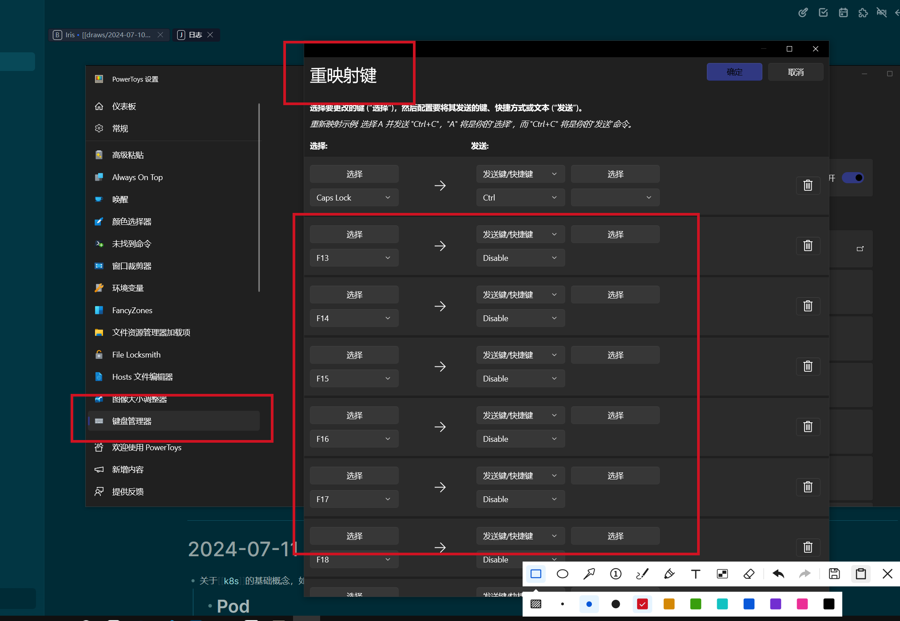

- [[战锤40K]] 黑暗之王 [[摘录]]
	- > 她不再相信这就是她被选中的目的。她现在相信她的目的是相当不同的，是她被允许瞥见的伟大目标的一部分。毕竟，信仰是关键。不是相信已证实的事实，而是解放出无条件的盲信，是不需要证明或验证的盲信。献出自由和对他的承诺，相信他，不是把他作为一个神，也不是作为一个人，而是作为一个过程，一条道路，一个未来的结构。
	- > 我将告诉他我不会死。我将面对四神，否认他们，我将切断连接在被它们蒙骗的傀儡，我的首归之子身上的丝线，然后我将凯旋，回到我的王座上，在这里坐上万年又万年。
	- > 他们犹豫了一下，随即点头离开。没有道别的话。这正是她一直以来为什么这么喜欢白疤的原因。每一次离别都不会伴随着哀伤，因为每一次离别都是在期待重逢。对于这些人生还如此短暂的战士们来说，这是一种令人宽慰的乐观态度。
	- > 但在他的眼中，我看出他明白了我这么做其实只是为了他。最高尚、最伟大的行为总是源于个人因素。
	-
- github [[镜像]]
	- releases文件下载 <https://moeyy.cn/gh-proxy>
- [[Krita]] 快捷键失效解决方案之一
	- 快捷键失效是因为某些软件始终按住F13-F24不放，解决方案是使用Powertoys去屏蔽F13-F24
	- 