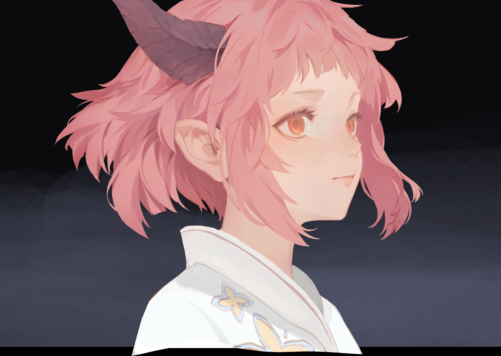

- DOING 尝试临摹一下这张角娘…K大23年色彩课的第一个作业，我觉得这个作业似乎并非基础，上来就做透光，**我其实更好奇这角娘本身是怎么画出来的…所以我决定这么来一下**…**注意先卡大的明暗，形状，颜色，要找到这种边缘的感觉**
  collapsed:: true
  :LOGBOOK:
  CLOCK: [2024-07-16 Tue 00:13:37]
  CLOCK: [2024-07-16 Tue 00:13:40]
  :END:
	- 
- EMO了，那张[桃子](((6693f634-a0d0-4cbc-8299-35cc21be4a2a)))画出来感觉良好，然后这张[广](((669514a4-4072-4cef-b30e-b611c3010974)))又把自信心打的稀碎，继续看K大吧，我实际上挣扎在第一步——**固有色和闭塞阴影**。
- 继续看K大啊，妈的