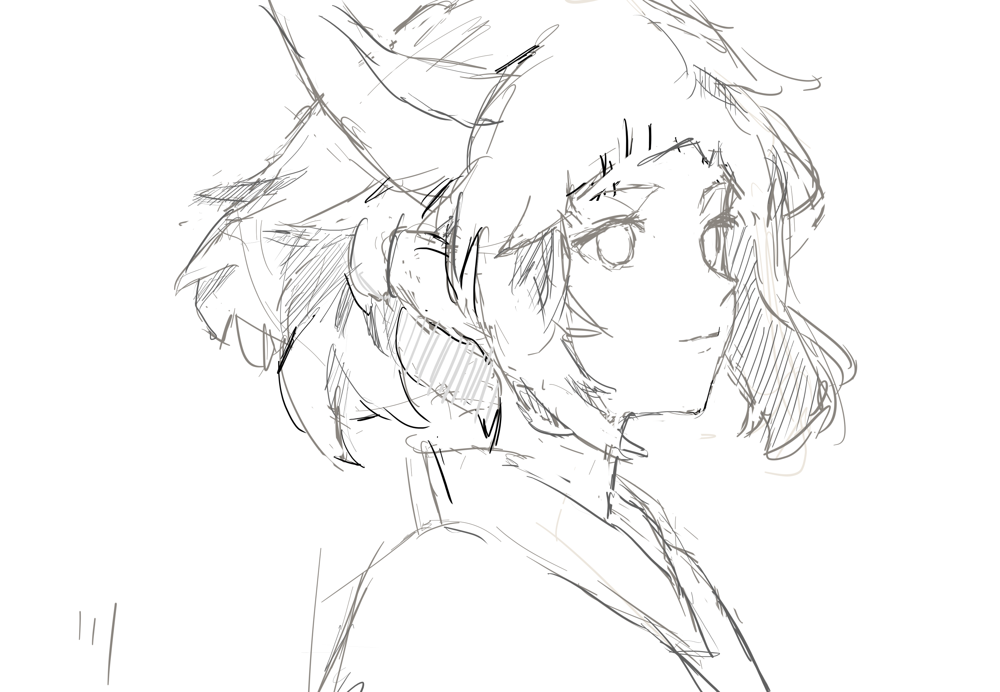
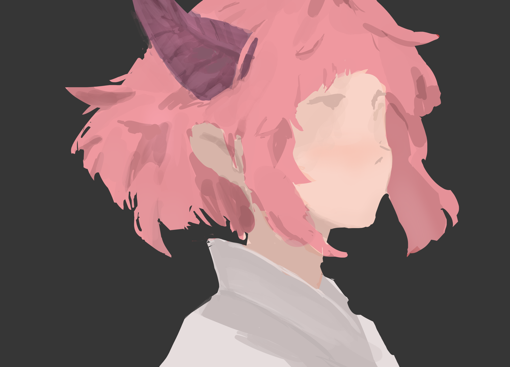

- #snippet/js nodejs 脚本模板
  collapsed:: true
	- 需要`npm i shelljs execa`，并且文件扩展名需要用`mjs`（因为execa是ESM格式，导入它不方便），这里颇为蛋疼，如果是反复用的脚本考虑另外写个shell或bat去引用它。
	- 执行文件操作等时使用shelljs，执行外部命令时使用execa以保证跨平台兼容，不用关心不同shell的语法区别（但这不代表这差别就不存在了！），这里指定execa为同步模式，且reject为false，stdout继承（返回code非0时不抛异常，命令的输出流均继承），使其和shelljs行为类似。
	- ```js
	  #!/usr/bin/env node
	  import { randomUUID } from 'crypto'
	  import { basename, resolve, join, dirname } from 'path'
	  import {$ as __$} from 'execa'
	  const $ = __$({reject:false, stdout: 'inherit'}).sync
	  
	  import shelljs from 'shelljs'
	  const {cd, cat, cp, which, echo, chmod, config, exit, ls, dirs, env, error, uniq, touch, test, mkdir, tempdir, tail, sort, set, sed, rm, pwd, pushd, popd, find, grep, head, ln, mv} = shelljs
	  
	  
	  // PUT YOUR SCRIPT HERE
	  cd(dirname(process.argv[1])) // cd到脚本目录
	  
	  // ===============================
	  // ===============================
	  // ===============================
	  
	  function mktempdir() {
	      const temp = tempdir()
	      const res = join(temp, randomUUID())
	      mkdir(res)
	      return res
	  }
	  
	  function assertWitch(...cmds) {
	      let missingCmd = cmds.filter(cmd => !which(cmd))
	      if (missingCmd.length !== 0) {
	          missingCmd.forEach(cmd => echo(`command '${cmd}' missing`));
	          exit(1);
	      }
	  }
	  ```
- #绘画记录 临摹K大色彩第一课的 [角娘](((6695495e-9292-4751-95d0-fd9f26c6a7fa)))
  id:: 669aa005-532e-4772-9b62-2f1e7b3fd98b
	- 这张图要勇于去找边缘，考虑到这张图的主要是硬边，主要用硬笔，只有偶尔需要混色的时候用用软笔；画的时候要注意概括——先大形状，后小形状，先粗略的阴影，后细致的阴影……
	- 首先是草稿，随便画画
	  logseq.order-list-type:: number
		- 
		-
	- 然后是做剪切蒙版，铺底色，然后用正片叠底简略画阴影，正片叠底的颜色是随意选择的，因此这里没有在意阴影的色相，后续有需要就调
	  logseq.order-list-type:: number
		- 
		-
	- 今天就这样了，明天再继续，开始逐步抠细节，注意要保证各部分的完成度保持统一……或者不这么干，总之这玩意不简单，真的不简单，头发这些复杂的形状原作者究竟是怎样想出来的……**我为什么只能画出面片似的头发，我该如何去训练去画这种复杂形状和体积的头发**？
	  logseq.order-list-type:: number