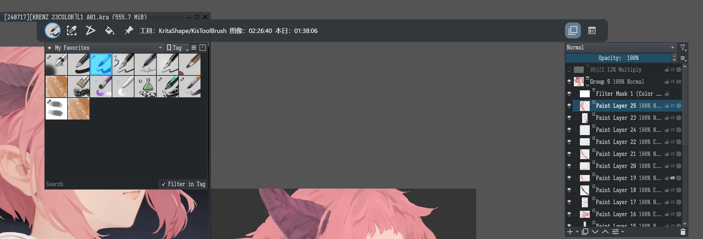

- 这几天把[krita-http-api](https://github.com/V-YOP/krita-http-api)好好整了一下，现在已经可用了——
	- 
	- 后续会继续开发，让大多数时候都能进行全屏绘画，但要注意这玩意前端是只写给我自己用的，不用费心想着可配置，兼容性！
- 不知道为什么，感觉日子越发没有盼头。回想起你的初心，混蛋，你想当的是漫画家！
  id:: 66a66d2a-df71-4fd6-90da-281df6a29f96