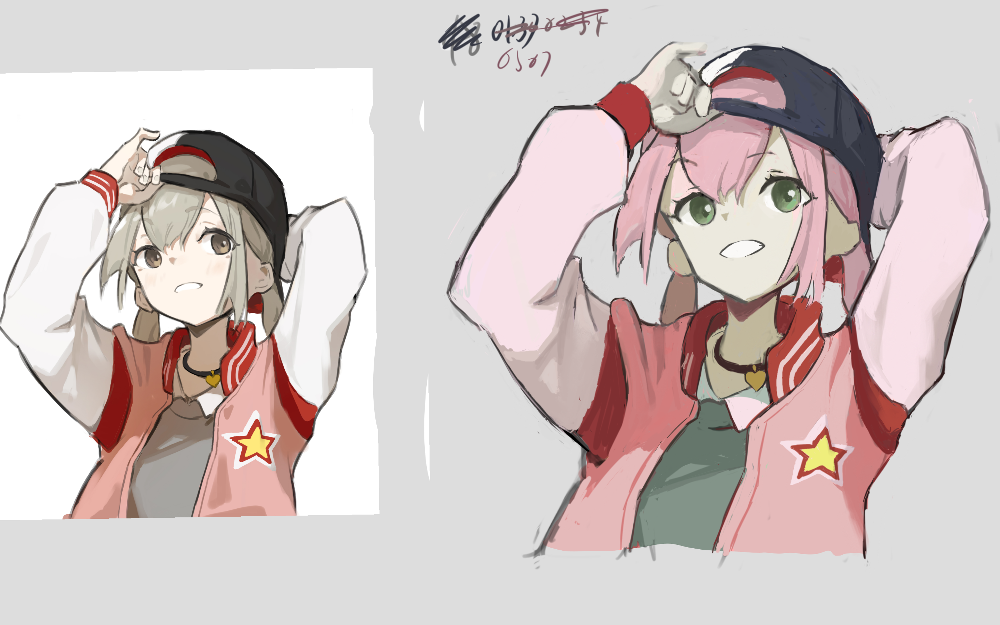

- 这个月前四天一笔没画，hhh
- 虽然想当的是漫画家，但也要记住学习时首先要学习的还是写实，厚涂，因为漫画、赛璐璐等终究是对其的进一步抽象化和概括，如果最原始的东西没搞懂，那就只能人云亦云，搞不出自己的一套东西。
	- ((66a66d2a-df71-4fd6-90da-281df6a29f96))
- 关于keepalived的router_id
	- **virtual_router_id 每个集群中每台机器一致，同时必须在整个网络环境中唯一，即使 virtual_ipaddress 不同**。
- #绘画记录 一张pjsk的图，这个老师的画风很有味道，但我上来就没处理好，用的是先软后硬的思路，导致后面各种修边。此外形也没处理好，光关注色了。
  collapsed:: true
	- 
	- 这张花了三个半小时，但学嘛。
	- 这个老师的。
		- {{embed ((669514a4-b816-4d38-bbf9-a5e64911b9db))}}
- #绘画实验 研究软硬边缘效果，比较失败，因为选题不好，也没有正确控制形状一致，没能体现出两种边缘的效果的区别。
	- 似乎的收获：
		- 似乎软笔刷在蹭线时，乃至普通的笔触上都更容易做出平滑的边缘，硬笔刷相比来说就相对糙一些。**考虑勾线时可以适当调低fade**，虽然代价是线稿会稍微糊一些，但我本身也不追求那样精细的线稿……而且这影响恐怕上色后也是比较难看出来的。
		  logseq.order-list-type:: number
		- 蹭线时情况会稍微有些复杂……笔刷大小同样会影响软硬，如果笔刷太小，0%的fade和50%的fade看上去没差别
		  logseq.order-list-type:: number
	-
	- 
	- 原图来自 <https://www.pixiv.net/artworks/119727511>，左边使用100%fade，右边是50%fade。
	- 教训：
		- 选题选好点，**这张图可见的边缘数量是比较少的**，而且全是暗色调，识别各种暗色的区别眼睛都要瞎了。
		  logseq.order-list-type:: number
		- 下次做对比的时候控制好形状，考虑先把各阶段的硬边的形状去画出来，后面再重画成软边，使得两边形状总是一致的，好作对比
		  logseq.order-list-type:: number