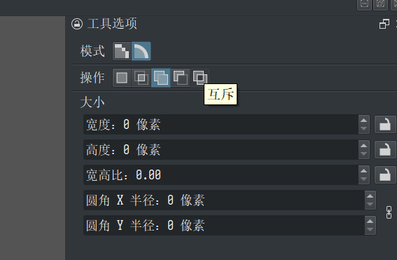
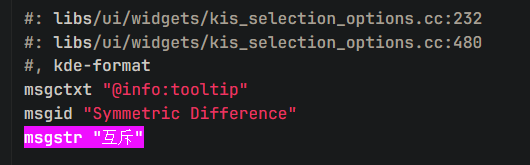
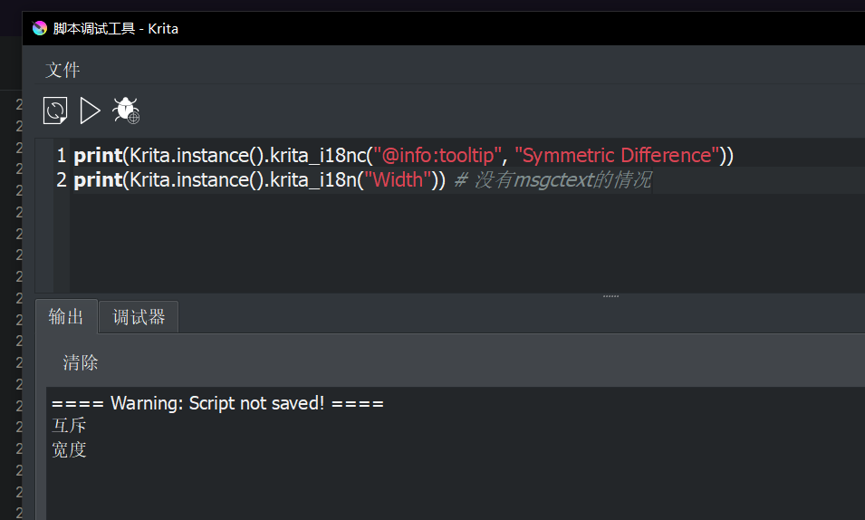

- #Krita 关于Python脚本中 `Krita.instance().krita_i18n`和 `krita_i18nc` 的用法
	- 这两个函数为Krita提供的国际化函数，用于把占位符转换为当前显示语言。前者直接接受占位符，后者另外接受一个所谓的上下文参数。字典文件位于源代码下 [po/语言缩写/krita.po](https://invent.kde.org/graphics/krita/-/blob/master/po/zh_CN/krita.po)。
	- 该方法的用途我认为如下：
		- 如果要引用Krita中的文本，可以使用此法进行国际化
		  logseq.order-list-type:: number
		- **有时候会需要通过tooltip或text去找到相应widget**（真的需要这么干的时候就是真的无计可施了，Krita自己根本没想着要把这玩意儿暴露出来），此时可以使用此法使得插件在其它语言中仍旧可用
		  logseq.order-list-type:: number
	- 使用方式：
		- 在Krita中找到想要获取的文本，如下图试图根据文本找到该按钮：
		  logseq.order-list-type:: number
			- 
		- 进入当前语言的字典文件，搜索 `msgstr "该文本"`，找到相应字典（如果是英语，就随便找一个文件，搜msgid，因为此时msgid就是英语原文）：
		  logseq.order-list-type:: number
			- {:height 173, :width 530}
		- 如果字典中存在 `msgctext`字段，调用 `krita_i18nc` 方法，其中msgctxt为第一个参数，msgid为第二个参数；如果不存在，则调用`krita_i18n`方法，传入msgid字段
		  logseq.order-list-type:: number
			- 
-
-