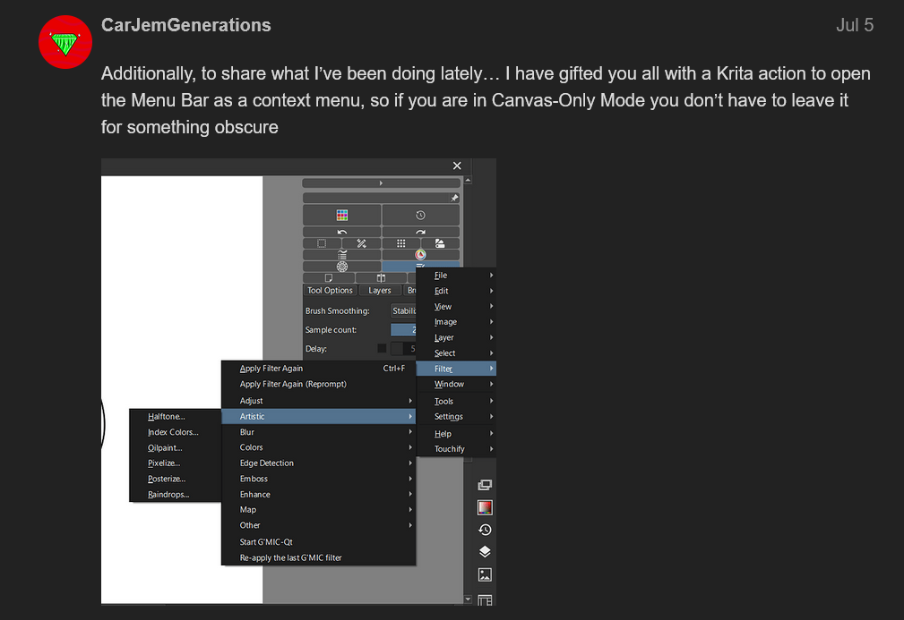
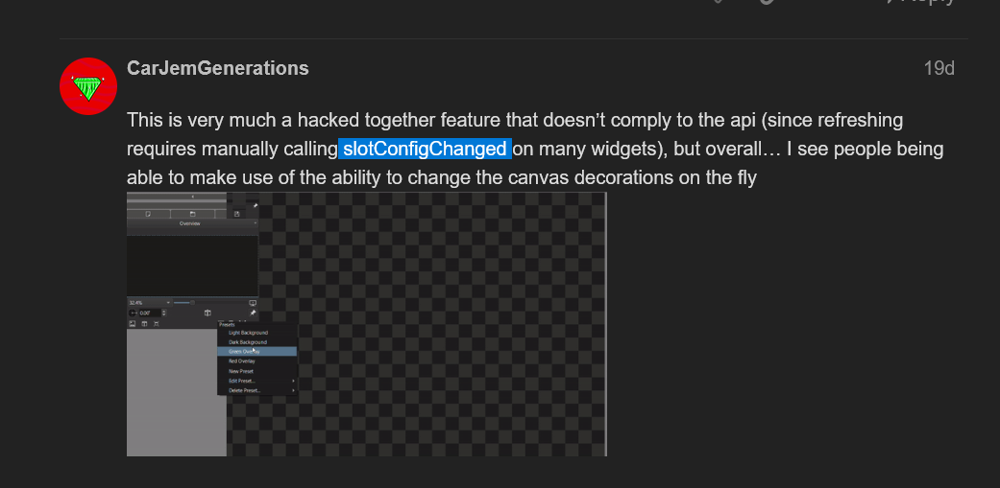

- #Docker compose #yaml 抽象重复配置
	- yaml提供了语法，提供一种“引用”其他部分定义的变量的方式，可以用来做Docker Compose的配置抽象。该操作的语法和C的取指针和解引用相同，使用`&`定义引用，使用`*`去解引用。
	- ```yaml
	  # 这里的 'x-microservice-config' 无关紧要
	  # 但docker compose对顶层的变量有名称要求，这里以x-开头反正是能规避它
	  x-microservice-config: &microserviceShared
	        TZ: Asia/Shanghai
	        NACOS_HOST: 127.0.0.1
	        NACOS_PORT: 8848
	        MYSQL_HOST: 127.0.0.1
	        MYSQL_PWD: 123
	        # ...
	        
	  services:
	      some-service:
	        image: ...
	        environment:
	          # 这里的 <<: 猜测是一种“展平”语法，不纠结它
	          <<: *microserviceShared
	          OTHER_ENV: ...
	  ```
- Ubuntu 22.04 [[Docker]] [[环境搭建]]
  id:: 66c694a4-b838-4a9e-903e-85ab836da4a2
  collapsed:: true
	- 参考 <https://blog.csdn.net/magic_ll/article/details/139985543> 和 [Ubuntu USTC Mirror help](https://mirrors.ustc.edu.cn/help/ubuntu.html)
	- ```sh
	  # 更换 APT 源
	  sudo sed -i 's@//.*archive.ubuntu.com@//mirrors.ustc.edu.cn@g' /etc/apt/sources.list
	  
	  sudo apt update
	  
	  # 安装可能缺失的依赖
	  sudo apt install apt-transport-https ca-certificates curl gnupg-agent software-properties-common -y
	  
	  # 添加Docker GPG密钥并添加仓库
	  curl -fsSL https://mirrors.aliyun.com/docker-ce/linux/ubuntu/gpg | sudo apt-key add -
	  sudo add-apt-repository  \
	  "deb [arch=amd64] https://mirrors.aliyun.com/docker-ce/linux/ubuntu $(lsb_release -cs) stable"
	  
	  # 安装docker
	  sudo apt install -y docker-ce docker-ce-cli containerd.io
	  
	  # 更换Docker源
	  sudo tee /etc/docker/daemon.json > /dev/null <<EOF
	  {
	      "registry-mirrors": [ "https://docker.ketches.cn" ]
	  }
	  EOF
	  
	  # 重启 Docker 以应用源
	  sudo systemctl restart docker
	  
	  # 测试能否拉取
	  sudo docker run --rm hello-world
	  ```
- [[Docker]] 移动docker数据位置（以腾出空间）
  collapsed:: true
	- 执行此操作考虑删除所有容器，镜像和卷，否则现存的容器，以及使用这些镜像创建的容器可能会出现各种奇怪的权限问题。
	- ```sh
	  # 删除所有容器
	  docker stop $(docker ps -q)
	  docker rm $(docker ps -a -q)
	  
	  # 删除所有镜像和卷
	  docker system prune --all -f
	  docker volume prune --all -f
	  
	  
	  # 关闭docker
	  systemctl stop docker
	  
	  # 创建新Docker目录，假设是 /opt 下，同步旧文件
	  mkdir -p /opt/docker
	  
	  # 全新安装的docker不需要做同步
	  # rsync -aP /var/lib/docker/ /opt/docker/
	  
	  # 编辑配置文件，重启
	  tee /etc/docker/daemon.json > /dev/null <<EOF
	  {
	  	"data-root": "/opt/docker",
	      "registry-mirrors": [ "https://docker.ketches.cn" ]
	  }
	  EOF
	  systemctl start docker
	  
	  # 验证
	  docker info | grep "Docker Root Dir"
	  ```
- #MySQL 移动数据位置（以腾出空间）
	- ```sh
	  systemctl stop mysql
	  
	  mkdir -p /data/mysql
	  chown mysql:mysql /data/mysql
	  chmod 750 /data/mysql
	  
	  rsync -av /var/lib/mysql/ /data/mysql/
	  chown -R mysql:mysql /data/mysql
	  
	  # 编辑 /etc/mysql/my.cnf，添加：
	  [mysqld]
	  datadir=/data/mysql
	  
	  # 编辑 AppArmor
	  vim /etc/apparmor.d/usr.sbin.mysqld
	  # 把 /var/lib/mysql 都替换成 /data/mysql
	  
	  # 刷新 AppArmor
	  apparmor_parser -r /etc/apparmor.d/usr.sbin.mysqld
	  
	  systemctl restart mysql
	  ```
- #MySQL 导出数据库
	- ```sh
	  mysqldump \
	      -u root \
	      --password='abc' \
	      --single-transaction \
	      --quick \
	      --skip_add_locks \
	      --skip-lock-tables \
	      some_db    >  some_db.sql   
	  ```
- #MySQL 导入数据
	- ```sh
	  mysql \
	      -h 127.0.0.1
	      -u root \
	      --password="" \
	      some_db < some_db.sql
	  ```
- [[Docker ]] [[redis]] 集群 [[环境搭建]]
  collapsed:: true
	- docker compose：
		- ```yml
		    redis-node1:  # 服务名
		      image: redis:latest  # 使用的镜像
		      container_name: redis-node1 # docker启动的容器名
		      ports:  # 映射的端口 7001是redis server使用，17001是集群之间节点通信使用，都必须开放映射，如果不指定17001端口映射的话，创建集群的时候节点之间不能通信，集群会创建失败
		        - "7001:7001"
		        - "17001:17001"
		      volumes:  # 映射的容器卷
		        - ./redis-cluster/redis-cluster7001.conf:/usr/local/etc/redis/redis.conf
		        - ./redis-cluster/data:/data
		      command: bash -c "redis-server /usr/local/etc/redis/redis.conf"
		  
		    redis-node2:
		      image: redis:latest
		      container_name: redis-node2
		      ports:
		        - "7002:7002"
		        - "17002:17002"
		      volumes:
		        - ./redis-cluster/redis-cluster7002.conf:/usr/local/etc/redis/redis.conf
		        - ./redis-cluster/data:/data
		      command: redis-server /usr/local/etc/redis/redis.conf
		  
		    redis-node3:
		      image: redis:latest
		      container_name: redis-node3
		      ports:
		        - "7003:7003"
		        - "17003:17003"
		      volumes:
		        - ./redis-cluster/redis-cluster7003.conf:/usr/local/etc/redis/redis.conf
		        - ./redis-cluster/data:/data
		      command: redis-server /usr/local/etc/redis/redis.conf
		  ```
	- `redis.conf`（集群每个节点有自己的）：
		- ```
		  # 端口（7001 ~ 7006）
		  port 7001
		  # 可以连接的ip
		  bind 0.0.0.0
		  # 密码认证
		  requirepass Ldap12345
		  masterauth Ldap12345
		  # 开启保护模式
		  protected-mode yes
		  # 启动集群模式
		  cluster-enabled yes
		  # 配置文件名称（nodes7001.conf ~ nodes7006.conf）
		  cluster-config-file nodes7001.conf
		  # 节点超时时间
		  cluster-node-timeout 5000
		  # 当前节点ip
		  cluster-announce-ip 172.31.129.120
		  # 当前节点端口（7001 ~ 7006）
		  cluster-announce-port 7001
		  # 集群之间通信的端口号（17001 ~ 17006）
		  cluster-announce-bus-port 17001
		  # 启用AOF持久化
		  appendonly yes
		  ```
	- 随便进入其中一个redis容器，执行：
		- ```sh
		  redis-cli -a Ldap12345 --cluster create \
		      172.17.0.1:7001 \
		      172.17.0.1:7002 \
		      172.17.0.1:7003 \
		      172.17.0.1:7004 \
		      172.17.0.1:7005 \
		      172.17.0.1:7006 \
		      172.17.0.1:7007 \
		      172.17.0.1:7008 \
		      172.17.0.1:7009 \
		      --cluster-replicas 2 # 3 主 6 从
		  # 这里似乎是应当指定外部 IP？
		  ```
- #snippet/bash 通过tee命令直接写入多行文件
  collapsed:: true
	- tee命令把输入流传给每个给定它的文件，以及标准输出流，使用它结合heredoc语法可以直接通过命令去写入多行文件。
	- ```sh
	  tee path_to_file > /dev/null <<EOF
	  some
	  contents
	  EOF
	  
	  # tee -a 达到追加效果
	  
	  # 使用cat
	  cat > path_to_file <<EOF
	  some
	  contents
	  EOF
	  ```
	- ## tips
		- `> /dev/null` 是因为tee会把输入流也打印到标准输出流中，这里是为了避免这一点。
		- 这里使用 cat 命令也能达到同样效果，但cat需要重定向到文件才能操作，因此sudo会失效
	- 关于tee和cat名字的由来：
		- ## tee
			- **`tee`** 命令得名于管道配件中的 **T 型接头**。在管道系统中，T 型接头可以将流体从一条主管分成两条支管，或者将流体从两条支管汇合到一条主管上。
			- 类似地，`tee` 命令从标准输入读取数据，然后将数据**同时**写入一个或多个文件，并将其传递给标准输出。这种行为就像 T 型接头一样，将数据流分成两路：一路保存到文件，一路继续传递。
		- ## cat
			- **`cat`** 是 **“concatenate”**（连接）的缩写。它的主要功能是将文件内容连接并显示到标准输出。`cat` 可以用于将多个文件的内容连接在一起，并在终端显示，或者重定向到另一个文件。
			- 简单来说，`cat` 命令的设计初衷是为了连接（concatenate）文件内容并将其输出，因此命名为 `cat`。
- CANCELLEDKrita 插件，模仿 [Tablet Friendly Accessibility Plugin](https://krita-artists.org/t/in-development-tablet-friendly-accessibility-plugin/74630)
  :LOGBOOK:
  CLOCK: [2024-08-20 Tue 23:42:38]
  CLOCK: [2024-08-20 Tue 23:42:43]
  :END:
	- <https://krita-artists.org/t/subject-proposal-to-update-the-design-of-kritas-interface>
	- 占用上下左右，以及3个浮动Docker，提供一个总的配置项，其中包括在全屏时仍旧显示这些Docker，按钮默认大小等（其他大小均从这个默认大小开始算起？）
	  logseq.order-list-type:: number
	- 工具，Docker，Action（包括其它插件定义的，这要求信息不能在初始化时拿），全部允许自定义，排序；每类按钮提供自己的配置项，每个按钮提供自己的配置项（怎么做最合适还得考虑）
	  logseq.order-list-type:: number
		- 其中，工具，Action始终同步enabled，checked状态，是否橡皮擦模式显示在当前工具底下（需研究这个该怎么去绘制，妈的不会要用到底层的PaintDevice之类的吧，难做就算了，另外展示出来）
		  logseq.order-list-type:: number
		- 似ps的嵌套工具先不做，做起来蛋疼
		  logseq.order-list-type:: number
	- 此外，提供——固定笔刷，笔刷历史，上下文工具选项，margin，当前状态label（如同默认的底部的状态栏）
	  logseq.order-list-type:: number
	- 做的时候考虑每类都做抽象……考验python功底的时候到了，PyQt就……尽量
	  logseq.order-list-type:: number
	- 支持为按钮绑定按键，按下按键时能切换到该工具或Docker
	  logseq.order-list-type:: number
	- 主菜单选项也弄出来
	  logseq.order-list-type:: number
	  collapsed:: true
		- 
		  logseq.order-list-type:: number
	- 配置项要用dialog去做
	  logseq.order-list-type:: number
	- 尽量小巧，尽量用快捷键
	  logseq.order-list-type:: number
- 关于Krita的一些研究，留痕
	- DONE 研究这个slotConfigChanged（可能没什么用？）
	  collapsed:: true
	  :LOGBOOK:
	  CLOCK: [2024-08-21 Wed 00:40:15]--[2024-08-21 Wed 09:15:35] =>  08:35:20
	  :END:
		- {:height 374, :width 749}
		- 只有两个widget包含该slot，其ClassName为KisOpenGLCanvas2 和 KisBrushOpSettingsWidget，前者是画布，后者好像是笔刷编辑器的，似乎没啥价值
		- ```python
		  from krita import *
		  from PyQt5.QtCore import *
		  from PyQt5.QtWidgets import *
		  
		  for child in Krita.instance().activeWindow().qwindow().findChildren(QWidget):
		      meta = child.metaObject()
		      try:
		          meta.invokeMethod(child, 'slotConfigChanged', Qt.QueuedConnection)
		          print(f'{child.objectName()=} {meta.className()=} success')
		      except:
		          pass
		  ```
	- DONE 研究如何以上下文menu形式呼出顶层菜单
	  :LOGBOOK:
	  CLOCK: [2024-08-21 Wed 00:43:22]--[2024-08-21 Wed 09:37:38] =>  08:54:16
	  :END:
		- 直接把menubar获取到，手动构造一个QMenu，然后执行exec即可，下面是GPT给的demo：
			- ```python
			  import sys
			  from PyQt5.QtCore import Qt
			  from PyQt5.QtWidgets import QApplication, QMainWindow, QWidget, QMenuBar, QVBoxLayout, QPushButton, QMenu
			  
			  class MainWindow(QMainWindow):
			      def __init__(self):
			          super().__init__()
			  
			          self.initUI()
			  
			      def initUI(self):
			          self.setWindowTitle('Left-click to Show Top Menu')
			          self.setGeometry(100, 100, 400, 300)
			  
			          # 创建菜单栏
			          menubar = self.menuBar()
			  
			          # 添加菜单和菜单项
			          file_menu = menubar.addMenu('File')
			          file_menu.addAction('New')
			          file_menu.addAction('Open')
			          file_menu.addAction('Save')
			          file_menu.addAction('Exit')
			  
			          edit_menu = menubar.addMenu('Edit')
			          edit_menu.addAction('Undo')
			          edit_menu.addAction('Redo')
			          edit_menu.addAction('Cut')
			          edit_menu.addAction('Copy')
			          edit_menu.addAction('Paste')
			  
			          view_menu = menubar.addMenu('View')
			          view_menu.addAction('Zoom In')
			          view_menu.addAction('Zoom Out')
			          view_menu.addAction('Full Screen')
			  
			          # 中央小部件
			          central_widget = QWidget(self)
			          self.setCentralWidget(central_widget)
			  
			          layout = QVBoxLayout()
			          self.button = QPushButton('Left-click me', central_widget)
			          layout.addWidget(self.button)
			          central_widget.setLayout(layout)
			  
			          # 连接按钮的点击信号到显示菜单的槽函数
			          self.button.clicked.connect(self.show_menu_on_click)
			  
			      def show_menu_on_click(self):
			          # 获取菜单栏中的菜单项
			          menu = QMenu(self)
			  
			          # 获取顶级菜单栏中的菜单
			          for action in self.menuBar().actions():
			              submenu = action.menu()
			              if submenu:
			                  # 将顶级菜单栏的菜单添加到按钮点击菜单
			                  menu.addMenu(submenu)
			  
			          # 显示菜单，位置在按钮的左下角
			          menu.exec_(self.button.mapToGlobal(self.button.rect().bottomLeft()))
			  
			  if __name__ == '__main__':
			      app = QApplication(sys.argv)
			      main_win = MainWindow()
			      main_win.show()
			      sys.exit(app.exec_())
			  
			  ```
	- DONE  研究KanvasBuddy是使用什么widget创建浮动弹窗的
	  :LOGBOOK:
	  CLOCK: [2024-08-21 Wed 08:32:15]
	  CLOCK: [2024-08-21 Wed 08:32:23]--[2024-08-21 Wed 13:55:10] =>  05:22:47
	  :END:
		- KanvasBuddy直接使用QWidget，使用show去展示而非去作为什么窗口的子组件。妈的QT真的，有点东西。见 <https://github.com/Kapyia/KanvasBuddy/blob/master/kanvasbuddy/kanvasbuddy/uikanvasbuddy.py>。
	- DOING 研究借用Docker，以及redesign是如何把docker显示在画布中的
	  :LOGBOOK:
	  CLOCK: [2024-08-21 Wed 00:45:21]
	  CLOCK: [2024-08-21 Wed 00:45:23]
	  :END: