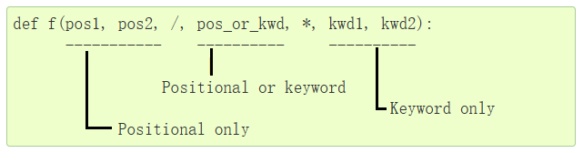

# DOING 作为脚本语言的python
:LOGBOOK:
CLOCK: [2024-08-24 Sat 08:06:41]
CLOCK: [2024-08-24 Sat 08:06:46]--[2024-08-26 Mon 16:58:48] =>  56:52:02
CLOCK: [2024-08-26 Mon 16:58:49]--[2024-08-26 Mon 16:58:58] =>  00:00:09
CLOCK: [2024-08-26 Mon 16:59:02]
:END:
	- 学习Python和一些常用第三方库，尝试以后使用Python去编写脚本。学习过程中不断感叹python标准库的丰富……
	- ## 字符串格式化
	  collapsed:: true
		- Python 提供了三种格式化方式——`%`，`str.format` 和 `f"{}"`。`%` 使用方式类似C的printf，形如` "My name is %s, I'm %d years old" % (name, age) `（单个参数可以不用元组），这里不表。
		- `str.format`和`f"{}"`则是更现代的方式，两者使用同样的语法去进行格式化，**并允许被格式化的对象自己决定用来格式化的微语言和结果**，两者区别在于，**`f"{}"` 直接把`{}`中的内容作为表达式，将计算后的结果去进行插值**，而`str.format`从传入参数中查找变量去插值：
		- ```python
		  print(str.format("my name is {0:>10s}, my age is {age}".format('haruka', age=17)))
		  
		  name = 'haruka'
		  age = 17
		  print(f"my name is {name:>10s}, my age is {age}")
		  ```
		- 因为`str.format`是从参数中查找的，所以既可以用参数下标索引，也可以用关键字索引，而`f"{}"`直接处理表达式，后面均使用`f"{}"`（因为它更美观且功能更强大，甚至支持嵌套的插值，只有在必须的情况下，比如需要重用模板，才使用`str.format`甚至`%`），并将之称为字符串格式化。
		- 字符串格式化的插值格式形如`{ any_expr [=][:<spec_lang>]}`，其中：
			- `str.format`在`:`前面只能是下标或参数名，不能有任何其他东西，而`f"{}"`则更花哨：
			  logseq.order-list-type:: number
			- 表达式前后能包含任意数量空白字符，其在插值时会被带过去
			  logseq.order-list-type:: number
			- 表达式后能包含一个`=`，其前后同样可以包含任意数量空白字符，当`=`存在时，整个表达式包括`=`会被**原样**打印，以方便debug，如：
			  logseq.order-list-type:: number
				- ```python
				  print(f"{  1 + 1   = }") # '  1 + 1   = 2'
				  ```
			- 在`:` 右侧是一个可选的格式化语言，其整个字符串会被传递给要格式化的对象的`__format__`方法，因此**任何类型都可以定制自己的格式化方法**。参考 ((66c6ab3d-91f7-464f-a9fb-d99c54882f8d))
			  logseq.order-list-type:: number
		- 关于格式化微语言，见各种示例：
		- ```python
		  from datetime import datetime
		  
		  some_float = 1234.5678
		  print(f"{some_float:f}")  # 默认6位小数，输出: 12345.678900
		  print(f"{some_float:.2f}")  # 输出: 1234.57
		  print(f"{some_float:10.2f}")  # 输出: '   1234.57'
		  print(f"{some_float:e}")  # 输出: 1.234568e+03
		  print(f"{some_float:.2e}")  # 保留2位小数，输出: 1.23e+03
		  
		  some_int = 12348
		  print(f"{some_int:d}")  # 输出: 12348
		  print(f"{some_int:x}")  # 小写十六进制，输出: 303c
		  print(f"{some_int:X}")  # 大写十六进制，输出: 303C
		  print(f"{some_float:%}")  # 默认6位小数，输出: 123456.780000%
		  print(f"{some_float:.1%}")  # 保留1位小数，输出: 123456.8%
		  print(f"{1234567890:,}")  # 输出: 1,234,567,890
		  
		  name = "Alice"
		  print(f"{name:<10}")  # 左对齐，输出: 'Alice     '
		  print(f"{name:>10}")  # 右对齐，输出: '     Alice'
		  print(f"{name:^10}")  # 居中对齐，输出: '  Alice   '
		  print(f"{name:_^10}")  # 居中对齐，使用_去填充，输出: '__Alice___'
		  
		  print(f"{42:0>10}")   # 右对齐，使用0而非空格去填充，0000000042
		  
		  now = datetime.now()
		  print(f"{now :%Y-%m-%d %H:%M:%S}")  # 输出: '2024-08-26 12:34:56'
		  ```
	- ## 正则表达式
	  collapsed:: true
		- 直接贴上GPT给的示例，注意其中的`\b`是零宽断言，匹配单词边界：
		- ```python
		  import re
		  
		  # 示例文本
		  text = "The quick brown fox jumps over the lazy dog."
		  
		  # 1. 匹配：使用 re.search() 查找第一个匹配项
		  match = re.search(r'\b\w{5}\b', text)  # 匹配五个字母的单词
		  if match:
		      print(f"Match found: {match.group()}")  # 输出: Match found: quick
		  
		  # 2. 流式查找匹配结果：使用 re.finditer()
		  pattern = re.compile(r'\b\w{5}\b')  # 匹配五个字母的单词
		  for match in pattern.finditer(text):
		      print(f"Match found: {match.group()} at position {match.start()}-{match.end()}")
		      
		  # 输出:
		  # Match found: quick at position 4-9
		  # Match found: brown at position 10-15
		  # Match found: jumps at position 20-25
		      
		  # 3. 查找：使用 re.findall() 查找所有匹配项
		  matches = re.findall(r'\b\w{5}\b', text)
		  print(f"All matches: {matches}")  # 输出: All matches: ['quick', 'brown', 'jumps']
		  
		  # 4. 替换：使用 re.sub() 进行简单替换
		  # 替换所有长度为4的单词为 '****'
		  pattern = re.compile(r'\b\w{4}\b')
		  replaced_text = pattern.sub('****', text)
		  print(f"Regex replacement: {replaced_text}")
		  # 输出: Regex replacement: The quick brown fox jumps **** the **** dog.
		  
		  # 5. 替换：使用 re.sub()，替换时引用捕获组
		  # 给所有长度为4的单词前后添加 #
		  pattern = re.compile(r'\b(\w{4})\b')
		  replaced_text = pattern.sub(r'#\1#', text)
		  print(f"Regex replacement: {replaced_text}")
		  # 输出: Regex replacement: The quick brown fox jumps #over# the #lazy# dog.
		  
		  
		  # 6. 替换：使用 re.sub() ，使用函数进行替换
		  # 替换函数示例：将匹配到的单词转换为大写
		  def replace_function(match):
		      return match.group().upper()
		  
		  replaced_text = re.sub(r'\b\w{5}\b', replace_function, text)
		  print(f"Replaced text with function: {replaced_text}")
		  # 输出: Replaced text with function: The QUICK BROWN fox JUMPS over the lazy dog.
		  
		  
		  ```
	- ## 文件/路径操作
	  collapsed:: true
		- 文件操作主要使用如下标准库和方法：
			- `os`：提供一切POSIX提供的玩意儿，在这里包括但不限于删除，重命名，创建/读取文件夹，删除非空文件夹，修改工作目录等操作。
			  logseq.order-list-type:: number
				- `getcwd/chdir`：获取/设置工作目录
				  logseq.order-list-type:: number
				- `listdir`：列举文件夹内容
				  logseq.order-list-type:: number
				- `mkdir/makedirs`：创建文件夹，递归创建文件夹
				  logseq.order-list-type:: number
				- `remove/unlink`：删除文件
				  logseq.order-list-type:: number
				- `rmdir/removedirs`：删除空目录，递归删除空目录
				  logseq.order-list-type:: number
				- `rename`：重命名文件/文件夹
				  logseq.order-list-type:: number
				- `stat`：获取文件/文件夹状态（获取文件类型使用`os.path.isXXX`)
				  logseq.order-list-type:: number
				- `walk`：递归遍历文件夹，返回一个迭代器，迭代值为 `(当前目录，子目录，子文件)`
				  logseq.order-list-type:: number
			- `os.path`：路径操作，但也包含一些和`os`交叉的部分
			  logseq.order-list-type:: number
				- `join`：路径拼接（同nodejs的join，不会主动转换成绝对路径）
				  logseq.order-list-type:: number
				- `abspath`：相对路径到绝对路径
				  logseq.order-list-type:: number
				- `isabs`：检查是否是绝对路径
				  logseq.order-list-type:: number
				- `basename`：获取路径中文件名部分
				  logseq.order-list-type:: number
				- `dirname`：获取路径中目录部分，即上级目录
				  logseq.order-list-type:: number
				- `exists`：文件是否存在
				  logseq.order-list-type:: number
				- `isfile/isdir/islink`：路径是文件/目录/链接，文件不存在时返回 False
				  logseq.order-list-type:: number
				- `getsize`：获取文件大小（字节）
				  logseq.order-list-type:: number
				- `split`：获取`(目录, 文件名)`**（注意这不是通常意义的split！）**
				  logseq.order-list-type:: number
				- `splitext`：获取`(其他部分, 扩展名（带dot）)`
				  logseq.order-list-type:: number
			- `shutil`：提供文件批量拷贝，移动，删除操作；提供`which`操作，提供压缩/解压缩操作（ zip和tar.gz 均支持，wtf在标准库里提供这个）
			  logseq.order-list-type:: number
				- `copy/copytree`：复制文件，递归复制目录
				  logseq.order-list-type:: number
				- `move`：移动文件
				  logseq.order-list-type:: number
				- `rmtree`：递归删除目录
				  logseq.order-list-type:: number
			- `tempfile`：创建临时文件、文件夹，考虑优先使用`TemporaryXXX`。
			  logseq.order-list-type:: number
				- `NamedTemporaryFile/TemporaryFile`：临时文件对象，可使用上下文管理器，关闭后自动删除，但该行为可配置，以及可以指定存储路径
				  logseq.order-list-type:: number
					- `NamedTemporaryFile`会保证文件有可见的文件名，这玩意儿在Win上行为和 `TemporaryFile` 是完全一样的，考虑始终使用`NamedTemporaryFile`
				- `TemporaryDirectory`：临时文件夹对象，可使用上下文管理器
				  logseq.order-list-type:: number
				- `mkstemp`：创建临时文件，返回文件描述符（似乎可以无视？）和路径
				  logseq.order-list-type:: number
				- `mkdtemp`：创建临时文件夹
				  logseq.order-list-type:: number
			- `glob`：使用`glob`语法筛选、遍历目录树
			  logseq.order-list-type:: number
				- `glob`：根据glob模式查找文件，注意**默认是非递归的**！
				  logseq.order-list-type:: number
				- `iglob`：同`glob`，但返回迭代器
				  logseq.order-list-type:: number
					- `escape`：转义特殊字符，需要匹配字面量时使用，如文件中包含`[]`时
					  logseq.order-list-type:: number
		- glob专用来匹配文件路径，它支持：
			- `*`：零个或多个任意字符，文件分隔符除外
			- `**`：零个或多个**路径**（这使得 `**/abc` 能够匹配文件 `abc`）
			- `?`：单个任意字符
			- `[]`：同正则，匹配特定字符集
	- 文件IO
	- ## 解析命令行参数
	  collapsed:: true
		- 参考 <https://blog.csdn.net/craftsman2020/article/details/129237425>。考虑到这个用的不会很多，用的时候现查文档就是了。
		- `sys.argv`列表第一个参数是脚本名称，剩余是命令行参数，但Python提供了内置库`argparse`去解析命令行参数。
		- `argparse`功能强大，允许声明式地添加参数，选项，提供完善的帮助消息，以及通过字典形式去获取用户输入。
		- 下面以一个转换工具来做示例，用户输入两个文件名，脚本把输入文件转换为输出文件，其中根据输出文件的扩展名判断输出文件类型，但也可以通过可选参数主动去传递：
		- ```python
		  import argparse
		  
		  parser = argparse.ArgumentParser(
		      description="A comprehensive argparse example.", # 描述，在帮助命令中显示
		      epilog="Example usage: script.py input.txt --log-level DEBUG" # 例子，在帮助命令中显示
		  )
		  
		  # 添加位置参数，这两个是必填的
		  parser.add_argument(
		      'input_file', type=str, help='Path to input file',
		  )
		  
		  parser.add_argument(
		      'output_file', type=str, help='Path to output file'
		  )
		  
		  # 添加无参选填参数
		  parser.add_argument(
		      '-q', '--quiet',
		      action='store_true', # 倘若用户给定，存储一个 True，否则存储一个 False
		      help='suppress all output'
		  )
		  
		  # 添加有参选填参数
		  parser.add_argument(
		      '--output-type', # 这里会保存到 output_file 变量
		      type=str,
		      # required=False,  # 这是默认行为
		      help='output type (would ignore output file extension if given)'
		  )
		  
		  # 添加枚举参数
		  parser.add_argument(
		      '--log-level', # 这里会保存到 output_file 变量
		      choices=['INFO', 'DEBUG'],
		      default='INFO',
		      help='output type (would ignore output file extension if given)'
		  )
		  
		  # 添加可反复给定参数
		  parser.add_argument(
		      '--add-filter',
		      type=str,
		      action='append'
		  )
		  
		  args = parser.parse_args()
		  print(args, args.input_file)
		  ```
		- 可选参数中的action有如下类型：
			- `store`：存储参数，多次出现取最后一个，默认行为
			  logseq.order-list-type:: number
			- `store_true`：存储一个true如果给定，否则存储一个False
			  logseq.order-list-type:: number
			- `store_const`：存储一个给定值，用户通过`const`参数传入该给定值
			  logseq.order-list-type:: number
			- `append`：参数存储为列表，每次给定后append
			  logseq.order-list-type:: number
			- `append_const`：参数存储为列表，用户通过`const`参数传入该给定值
			  logseq.order-list-type:: number
	- 爬虫，xml和html解析草
	- Excel 读写
	- 时间、日期处理
	- 系统调用
	- 数据可视化
	- 数据库操作
	- 简单图形界面
- # [[Python]] 的函数定义语法
	- Python的函数参数定义相当自由（不如说从没见过这么自由的语言），需要专门记录一下。
	- 
	- ## 最基础的函数定义形式
		- ```python
		  def f(a, b, *args, **kwargs):
		    	print(f'{a=}, {b=}, {args=}, {kwargs=}')
		  ```
		- 其中，a，b为固定位置参数，args为不定参数（直到这部分还和其它语言一致），kwargs为不定关键字参数，即使用`c=1, d=2`传入的参数。
		- 其传参时可以这么传：
		- ```python
		  f(1, 2, 'hello', 'world', c=1) # a=1, b=2, args=('hello', 'world'), kwargs={'c': 1}
		  f(b=2, a=1, c=3) # a=1, b=2, args=(), kwargs={'c': 3}
		  ```
		- 但这样是非法的：
		- ```python
		  f(b=2, a=1, 'hello', 'world', c=3) # Positional argument cannot appear after keyword arguments
		  ```
		- 由此可见，固定参数（a，b）既可以通过关键字传入，也可按位置传入，通过关键字传入时，**关键字参数可以认为是”剩余关键字函数“**；通过位置传入时，**不定参数可以认为是“剩余参数”**。根据该概念，我们可以这么操作：
		- ```python
		  def f(a, b, *args, c, **kwargs):
		    	print(f'{a=}, {b=}, {args=}, {c=}, {kwargs=}')
		      
		  f(1, 2, 'hello', 'world', c=3, d=4) # a=1, b=2, args=('hello', 'world'), c=3, kwargs={'d': 4}
		  f(b=2, a=1, c=3, d=4) # a=1, b=2, args=(), c=3, kwargs={'d': 4}
		  ```
		- 注意——这里的c，一个定义在`*`参数后面的参数，必须使用关键字传入，Python没有聪明到会自动把不定参的最后一个元素当作c，可以理解为**不定参数（和不定关键字参数）是贪婪的，会拿走所有它能拿走的参数**。
	- ## Python 3 提供了**仅限关键字参数**
		- ```python
		  def f(a, b, *, c):
		    	pass
		  
		  f(1, 2, c=1)
		  ```
		- 对`*args`的理解可以沿用，但一个区别是这里不能再传任何不定参了，这也是可以理解的——都没有绑定给变量了，传了也没有任何意义。
	- ## Python 3 提供了**仅按位置参数**
		- ```python
		  def f(a, /, b):
		    	pass
		    
		  f(1, b=2) # success
		  f(a=1, b=2) # fail
		  ```
		- `/`前的参数必须按位置去传参，其用途为保证用户不会按关键字去传参，保证后面可以随意修改参数名等。
	-