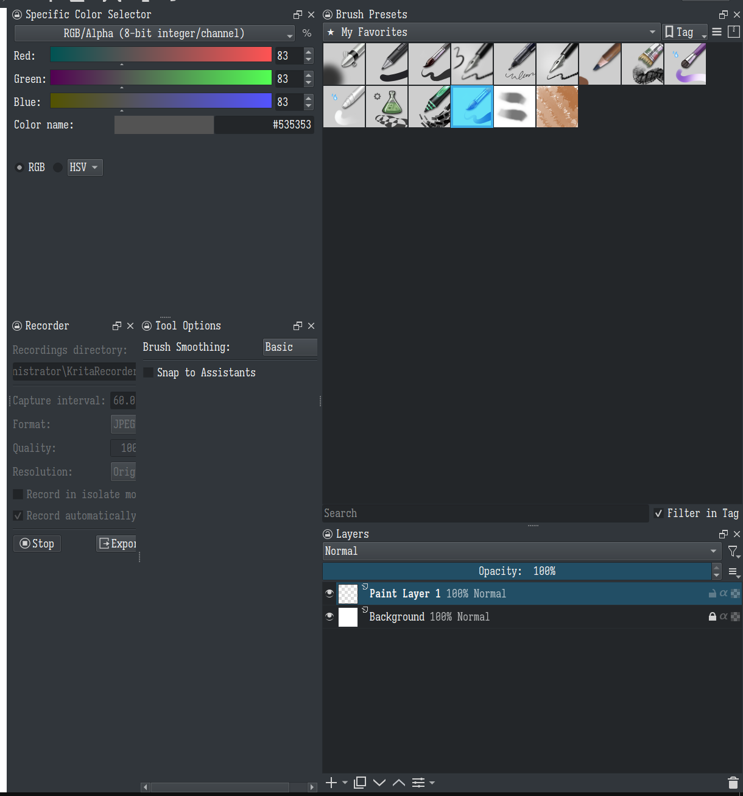

- 关于对Qt中DockWidget位置编排的心智模型（以左右侧为例）
	- Dock停靠位置乍一看像是网格布局，其实**仍旧是树状的**。使用HTML的形式去表示的话，要描述DockWidget位置的编排，需要有四类元素——水平布局VLayout，竖直布局HLayout，QDockWidget（同时指代单个和带标签页的）
	- 下面是一个相当复杂的布局，使用这四种元素去表示的话就是：
	- {:height 536, :width 477}
	- ```html
	  <HLayout>
	    <!-- 左半边 -->
	    <VLayout>
	      <QDockWidget class="Specific ..." />
	      <HLayout>
	        <QDockWidget class="Recorder" />
	        <QDockWidget class="Tool Options" />
	      </HLayout>
	    </VLayout>
	  
	    <!-- 右半边 -->
	    <VLayout>
	      <QDockWidget class="Brush Preset" />
	      <QDockWidget class="Layers" />
	    </VLayout>
	  </HLayout>
	  ```
	- 一些规律：
		- HLayout中，各子组件高度相同，宽度可调整
		  logseq.order-list-type:: number
		- VLayout中，各子组件宽度相同，高度可调整
		  logseq.order-list-type:: number
		- HLayout的子组件只能为VLayout和QDockWidget，VLayout的子组件只能为HLayout和QDockWidget
		  logseq.order-list-type:: number
		- logseq.order-list-type:: number