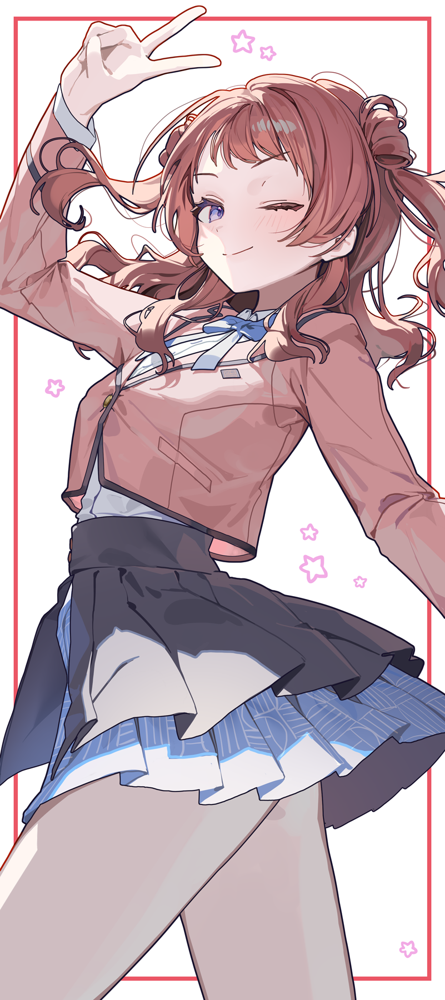
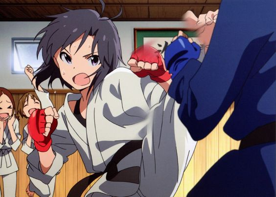

- #绘画/画师 [Enuni老师](https://www.pixiv.net/users/8062849)，全身+背景，舒适的镜头感，舒服的衣物的质感
	- {:height 1123, :width 487}
- #绘画/画师 [にんげんまめ](https://www.pixiv.net/users/38297201)，透明感，光影魔术师，绝不尝试“一般”的打光，使用“一般”的肤色
	- {:height 1064, :width 493}
- #绘画/点子 真哥好帅，格斗家的话拿来学人体很棒
	- 