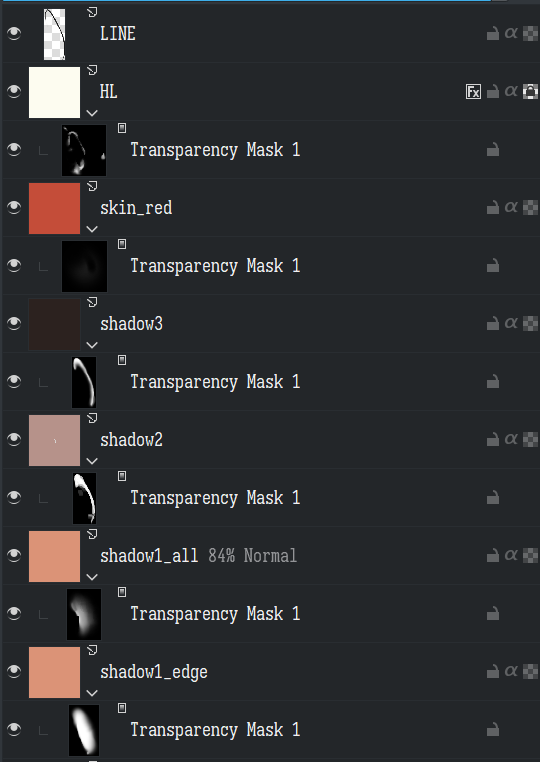
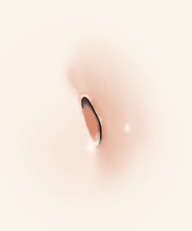

# #读书笔记 [ちょこっと解剖学](hls__ちょこっと人体解剖学で圧倒的にうまく描けるキャラクターデッサン_1728137446039_0)（かいぼうがく）-1
	- {{embed ((6701d757-c05c-4971-8cda-fa99651d0efc))}}
	- 边看外语书边做笔记真的是痛苦中的痛苦……
	- ## はじめに
	- 这本书面向绘画初学者，根本的主题是让读者了解“非常简单”的解剖学，以帮助其绘制人物。
	- ##  基本（きほん）の人体（じんたい）構造（こうぞう）
	-
- #日语积累 もらう 做敬语
	- もらう是收到的意思，但也**可委婉地表示让对方做某事**，可以认为是くれる的敬语（但有不同，もらう是我收到，くれる是对方给，强调对方的主动性），一个例子便能展示它们两个的尊敬程度：
		- ちょっと手伝ってくれますか？能帮帮忙吗？
		- ちょっと手伝ってもらえますか？能收到您的帮助吗？
	-
- # #读书笔记 [mignon画皮肤](hls__[机翻]mignonがしっかり教える「肌塗り」の秘訣_1728137440500_0)-1
	- {{embed ((6701d757-06bb-470a-a9a0-3b929d01e646))}}
	- 这本是技，但不止是（所以实际上仍旧还是不太适合初学者的可能）：
	- ((67027665-d63f-4550-97b2-353157a04c7a))
	- mignon老师用四种笔刷：
		- （硬刷）硬边大小不透明度，mignon老师先用该笔刷画形状，再用涂抹工具将其做晕染，或者使用软透明度橡皮擦擦出效果
		  logseq.order-list-type:: number
		- （软刷）软透明度橡皮擦，用来磨平硬刷，同时绘制渐变阴影
		  logseq.order-list-type:: number
		- 涂抹工具，这玩意儿的使用的心智模型究竟如何？它绝对不是表面上那点东西
		  logseq.order-list-type:: number
		- 硬边大小糙边缘，勾线用
		  logseq.order-list-type:: number
	- **蒙版法**，一种适用于二次元风格的画法，特点是**图层整个是纯色，使用不透明度蒙版做形状和渐变**。感觉**蒙版法其实就是把素描关系分离开来，以不透明度蒙版的形式去展现**。
		- 蒙版法有如下优点：
			- 随意调整配色方案
			  logseq.order-list-type:: number
			- 难以画错图层
			  logseq.order-list-type:: number
		- 有如下缺点：
			- 绘制相对复杂一些
			  logseq.order-list-type:: number
			- 需要很好地管理图层，如果没有建立起完善的工作流的话会束手束脚，而且对二次元以外的绘画风格并不方便
			  logseq.order-list-type:: number
			- 没法迅速地做效果
			  logseq.order-list-type:: number
		- 蒙版法显然特别适用于阶段清晰、明确的绘画，如赛璐璐，gal等画风。
	- 在肚脐示例里，有下面的图层（其实不使用蒙版法也能画，但快速调整颜色就稍微复杂一些）：
		- {:height 664, :width 447}
		- 从下往上分别是一影，二影，三影，高光，（皮肤血色）以及线条。一影这里分了两个，这是为了**调整整个一影的时候不至于影响基本阴影形状**。
		- **一影**：背光处直到明暗交界线，实际上就是整个shadow family了，但这一步还不够黑。这一步是基本的阴影色。考虑到形状处理的需要，可以将一影分为两个图层，一个形状更硬，另一个用来做过渡（透明度可以不设满）
		- **二影**，**三影**：两层闭塞阴影，二影是较亮的一层，三影是最暗的一层。
		- **高光**：高光，**为了体现皮肤质感，高光是必要的**。
		- 注意肚脐处就像**山脉**，有这样的特性：
			- 明暗交界线（即光照侧）软，投影边缘硬
			  logseq.order-list-type:: number
			- 光照侧高光硬，对侧高光软
			  logseq.order-list-type:: number
		- ((6702acc4-8376-4aa8-ae52-544172ce4046))
		- mignon老师同时指定了二影，三影和高光的图层样式，
		- 
		- 居然还能看woc，但是没有好好考虑到肚脐的结构，远没有mignon老师考虑的好。
		- #trick #绘画 处理显示圆润感的高光
			- 先用硬笔画出水滴形的高光，再使用涂抹工具把粗的一部分抹匀。
			- ((6702ad8a-2a49-4c89-aa6f-6d99c6ccbf57))