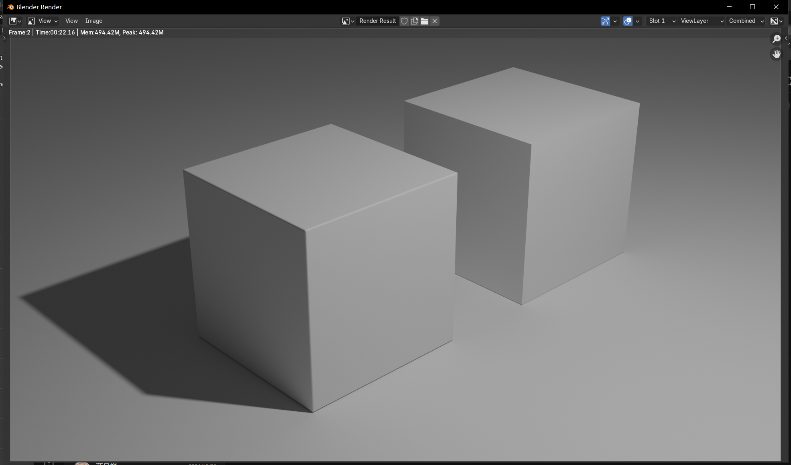

- DOING 今天学人体解剖学！同时画两三张速写，再找更多速写照片作参考！
  :LOGBOOK:
  CLOCK: [2024-10-13 Sun 01:00:33]
  CLOCK: [2024-10-13 Sun 01:00:35]
  :END:
- 创建页面 [[Blender 的编辑操作（Edit Mode）和建模Modeling]]
- 乐器中的**把位**和编程中的**心智模型**、**模式**非常类似——我们根据要解决的实际问题，即要弹奏的音符的调式和调性，或者要解决的特定编程领域的问题，来调整自己的“把位”或“心智模型”，而“把位”就其在“规范”的作用上和“模式”是类似的。归根结底，它们都是对实际问题的一种“看待方式”和“解决方式”，这么说来它们又和哲学的所谓**方法论**相似。本想为视图操作定一些把位的，但想想这玩意儿根本没必要这样，它没复杂到要定把位的程度，算了。
- 关于高光多么重要——加了倒角后的效果
	- {:height 391, :width 666}