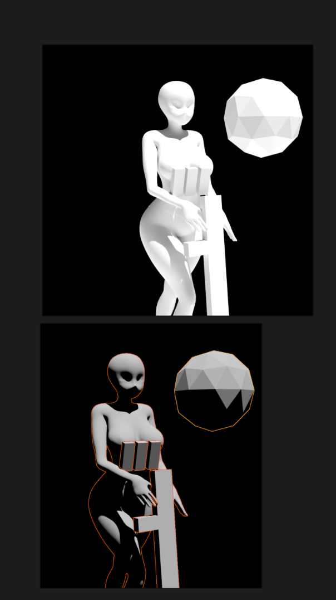

- #Awesome [Vendoy](https://www.ventoy.net/cn/index.html) U盘bootloader，能够直接引导U盘和本地硬盘上的ISO，VDI（从虚拟机创建的虚拟磁盘文件，这个需要插件）等文件
- DOING 这个周末化悲愤为动力，把blender这本书啃完！！！！！！！！！
  SCHEDULED: <2024-10-19 Sat>
  DEADLINE: <2024-10-20 Sun>
  :LOGBOOK:
  CLOCK: [2024-10-18 Fri 13:39:37]
  CLOCK: [2024-10-18 Fri 13:39:44]
  :END:
- #trick 使用 [[Blender]]做光影参考
  collapsed:: true
	- {:height 673, :width 379}
- 英雄主义，即使嘴上反驳，都无法反驳自己心里仍旧想要见到英雄和壮举。
- #坑 maven编译时注解处理器不起效？**检查`maven-compiler-plugin`的版本**
	- 这玩意儿没指定版本的话，不同环境用的版本会不一样，而低版本的`maven-compiler-plugin`不支持`annotationProcessorPaths`参数！
- 创建页面 [[Blender 中的修改器Modifier]]