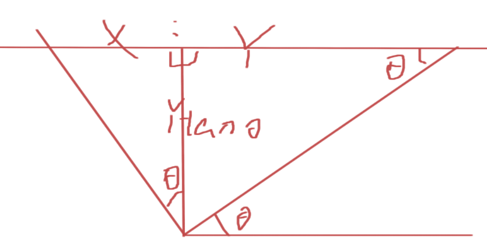
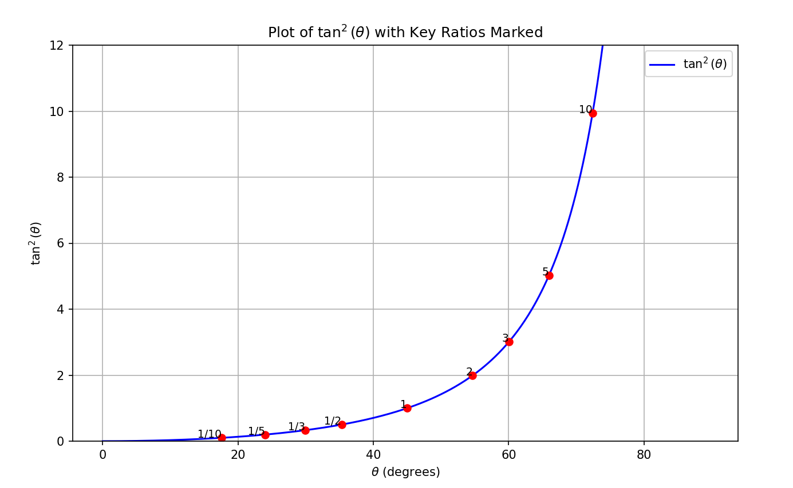

- 一个立方体沿Z轴逆时针旋转时，设旋转角度为$\theta$，两个消失点距离**画面中心线**（垂直二分画面的线）为$x$和$y$，有$x:y=tan^2\theta$
	- {:height 298, :width 529}
	- |逆时针旋转度数|0度|15度|30度|45度|60度|75度|90度|
	  |**比例分数**|0|0.072|0.333|1.000|3.000|13.928|$\infty$|
	  |**大致比例**|0|1/10|1/3|1|3|139/10|$\infty$|
	  |**精确比例**|0|7/97|1/3|1|3|1351/97|$\infty$|
	- {:height 465, :width 741}
- 一个正方体沿Z轴逆时针旋转时，设旋转角度为$\theta$，两个能为$x$和$y$，有$x:y=tan^2\theta$