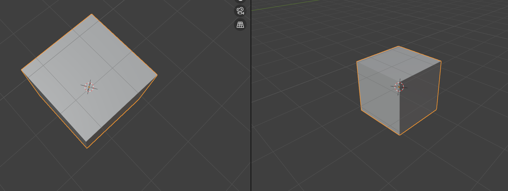

- #绘画/透视 大角度的俯视角下，会得到**完全不符合直觉**的感觉（记住它，让它成为新的直觉），深度的线极端的缩短：
	- 
	- 但看背后的线就会感觉这还好：
	- {:height 259, :width 272}
- #绘画/透视 已经画完了立方体的一个垂直面，怎么画另一个垂直面？**这个面在画面上越接近矩形，另一个面就畸变越大，透视点越接近画面**。
	- DOING 底面怎么说？
	  :LOGBOOK:
	  CLOCK: [2024-11-20 Wed 00:21:09]
	  CLOCK: [2024-11-20 Wed 00:21:11]
	  CLOCK: [2024-11-20 Wed 00:21:16]
	  :END:
- #think 要找透视图的规律——离开计算，辅助线的规律。
- #think 如果感觉立方体画得不对，尝试把它在z轴方向上做延长……？
- #think 一个画透视图的模式似乎是……先画俯视图……？有点抽象。
- #think 如果不知道做啥又不想画画，去弹吉他！单片机啥的后面再说！
- #吉他 random star的弦是09-42
-