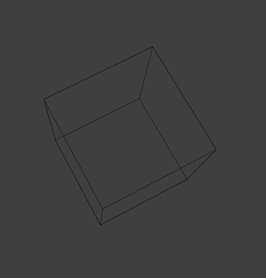

- #绘画/透视 大角度的俯视角下，会得到**完全不符合直觉**的感觉（记住它，让它成为新的直觉），深度的线极端的缩短：
	- 
	- 但看背后的线就会感觉这还好：
	- {:height 259, :width 272}
- #绘画/透视 已经画完了立方体的一个垂直面，怎么画另一个垂直面？**这个面在画面上越接近矩形，另一个面就畸变越大，透视点越接近画面**。
	- DOING 底面怎么说？
	  :LOGBOOK:
	  CLOCK: [2024-11-20 Wed 00:21:09]
	  CLOCK: [2024-11-20 Wed 00:21:11]
	  CLOCK: [2024-11-20 Wed 00:21:16]
	  :END:
- #think 要找透视图的规律——离开计算，辅助线的规律。
- #think 如果感觉立方体画得不对，尝试把它在z轴方向上做延长……？
- #think 一个画透视图的模式似乎是……先画俯视图……？有点抽象。
- #think 如果不知道做啥又不想画画，去弹吉他！单片机啥的后面再说！
- #吉他 random star的弦是09-42
- #think 红烧天堂是好作品，而且就连画风也好，我得把它的资源都毛到，然后去拿来当素材临摹！？
- #嵌入式 #cheetsheet 电学术语对照表
	- | **中文**             | **英文**              | **单位**           | **符号**         |
	  |---------------------|---------------------|------------------|----------------|
	  | **电压**             | Voltage             | 伏特（Volt, V）    | \( U \) 或 \( V \)  |
	  | **电流**             | Current             | 安培（Ampere, A）  | \( I \)         |
	  | **电阻**             | Resistance          | 欧姆（Ohm, Ω）     | \( R \)         |
	  | **功率**             | Power               | 瓦特（Watt, W）    | \( P \)         |
	  | **电容**             | Capacitance         | 法拉（Farad, F）   | \( C \)         |
	  | **电感**             | Inductance          | 亨利（Henry, H）   | \( L \)         |
	  | **电荷**             | Electric Charge     | 库仑（Coulomb, C） | \( Q \)         |
	  | **电导**             | Conductance         | 西门子（Siemens, S）| \( G \)         |
	  | **频率**             | Frequency           | 赫兹（Hertz, Hz）  | \( f \)         |
	  | **阻抗**             | Impedance           | 欧姆（Ohm, Ω）     | \( Z \)         |
	  | **导纳**             | Admittance          | 西门子（Siemens, S）| \( Y \)         |
	  | **磁通量**           | Magnetic Flux       | 韦伯（Weber, Wb）  | \( \Phi \)      |
	  | **磁场强度**         | Magnetic Field Strength | 安每米（A/m）     | \( H \)         |