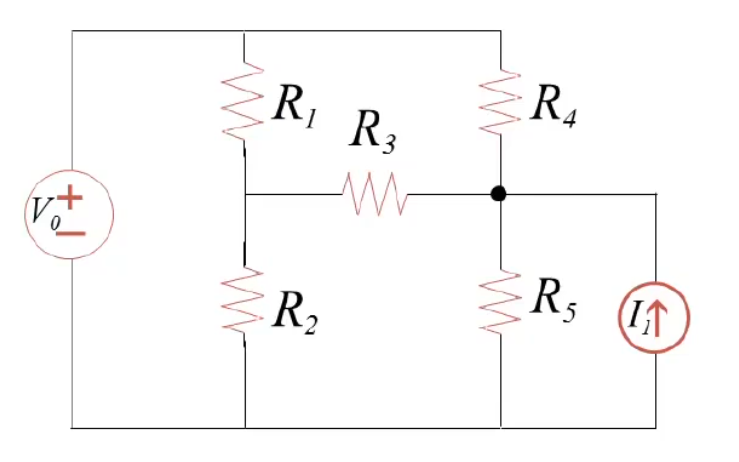

- #EE 什么是[[Arduino]]，它和直接使用C/C++编译到目标平台的区别
	- 简而言之，Arduino是一整个单片机开发平台，它对目标平台的硬件进行抽象（因此它是硬件抽象层HAL，虽然不完全），允许使用同一套高抽象层级的代码和库函数去操作硬件（但这不是说Arduino代码是跨平台，可移植的！）。使用Arduino和直接使用C/C++编译到目标平台，更像是两种不同的**程序框架**——它们支持不同的库函数，不同的代码结构和抽象层次——它们终究都能编译到**同一套**的目标机器语言，只不过一个相对更抽象，一个则相对更底层。得益于此，许多库的实现是可以不关心当前是Arduino还是原生去提供功能的。
		- 举例来说，arduino需要用户实现一个`setup`函数和一个`loop`函数，前者执行一次而后者反复执行，而直接使用C/C++（或者其他能够编译到机器码的编程语言如Rust）的话，则是需要编写`main`函数作为程序的入口
		- 当然，Arduino不止于此，它提供了方便的IDE以方便编写、编译、上传，调试代码，这里不表。
	- Arduino这层抽象层会让代码相对地远离底层硬件，因此性能可能会有一些降低。除了Arduino，单片机厂商也有其他手段以提供抽象层，如通过C库函数的形式，如ESP-IDF，它则和硬件更为接近，但开发也更为复杂。
- #EE [[RTOS]]的原理
	- DOING 下面的说法存疑
	  :LOGBOOK:
	  CLOCK: [2024-11-25 Mon 01:03:42]
	  :END:
	- RTOS是嵌入式操作系统，允许在嵌入式平台上进行任务调度，中断管理，内存调度等。就和在PC上编程一样。**从应用程序的角度来看，应用程序通过库函数去与RTOS交互**。
	- 但和桌面操作系统如Windows，Linux不同，**RTOS是和用户的应用程序一起烧写到单片机**上的，而非是先烧写OS到单片机上，然后再把应用程序当成“软件”去加载到单片机上供使用（其实也能这样）。
	- 一个可能马上就会感觉到的地方是，RTOS是基于底层的HAL去访问硬件的，因此它需要分别兼容Arduino和原生，**实际上并非如此**。实际上，Arduino和原生C/C++归根结底都会编译到同一套目标机器语言，因此，RTOS的实现上可以**不关心**当前使用的是Arduino和原生C/C++，它直接**建立自己的一套硬件抽象层**，根据当前处理器的架构去操作硬件以和外界打交道，这套硬件抽象层更底层，更通用，可移植。**RTOS的驱动程序则也是利用RTOS提供的这层硬件抽象层进行编码**，而不关心Arduino或原生代码提供的HAL。换句话说，这两个HAL是**并行**的，Arduino 和原生 C/C++ 代码既可用自己的库函数去访问硬件，也可以通过 RTOS 提供的 API 来访问硬件（和RTOS的系统资源）。
- #EE [[Arduino]] UNO的配置以及组成部分
	- DOING done me
	  :LOGBOOK:
	  CLOCK: [2024-11-24 Sun 22:02:59]
	  CLOCK: [2024-11-24 Sun 22:03:00]
	  CLOCK: [2024-11-24 Sun 22:03:01]
	  :END:
- #EE 关于各种常见元件的伏安特性曲线
	- 电阻，$V=IR$
	- 电压为$V_0$的理想电压源（内阻为0），$V=V_0$
	- 电流为$I_0$的电流源（内阻为无穷大），$I=I_0$
	- DOING 其他的...？复杂喽
	  :LOGBOOK:
	  CLOCK: [2024-11-24 Sun 23:04:38]
	  CLOCK: [2024-11-24 Sun 23:04:40]
	  :END:
- #EE 分析电路的KVL-KCL法，组件组合法，以及节点分析法
	- {{embed ((67433c44-081e-414f-92ee-0321c1c7ce4e))}}
	- 分析电路，即为确定每个元件上的电压、电流（称为支路变量）
	- 最基础的分析电路的方法即直接使用KVL-KCL，对每个环路根据KVL列出方程，对每个节点根据KCL列出方程，再根据各元件的伏安特性曲线列出相应方程，解这个方程组即可确定所有未知量。
	- 使用基尔霍夫法分析电路时，通常会遵循一些约定：
		- 使用关联参考方向，即使是电源也是如此
		  logseq.order-list-type:: number
		- 使用KCL时，使用流出方向，各处流出方向的电流的和为0
		  logseq.order-list-type:: number
		- 使用KVL时，沿着环路的方向，若先遇到元件的正极，则该元件电压取正值；反之，则取负值
		  logseq.order-list-type:: number
	- 仅使用基尔霍夫定律解题会引入太多的变量，解它们是很复杂和繁琐的，有必要去优化。
	- 组件组合法便是一个（临时）消除变量的方法，它允许将多个以特定形式连接的元件组合起来当作单个元件去看待，具体来说，有下面的这些组合法：
		- 串联的电阻$R_0,R_1,\dots,R_n$，等效于一个电阻$R=R_0+R_1+\dots+\R_n$
		- 并联的电阻$R_0,R_1,\dots,R_n$，等效于一个电阻$\frac{1}{R} = \frac{1}{R_0} + \frac{1}{R_1} + ... + \frac{1}{R_n}$
		- 串联的电压源$V_0,V_1,\dots,V_n$，等效于一个电压源$V=V_0+V_1+\dots+V_n$
		- 并联的电流源$I_0,I_1,\dots,I_n$，等效于一个电流源$I=I_0+I_1+\dots+I_n$
	- 组件组合法虽好，但只能处理简单的串并联，如果事情更复杂，就只能使用其他方法了。
	- 一种更优越且更有实践价值的方法是节点分析法，节点分析法的要点在于，定义一个**参考电势点**（有时候称为GND，通常使用地线符号去表示它），定义其它端点相对于参考电势的电势作为未知量，求出这些端点的电势，便能够得到各元件上的电势差，即电压，它的正负号代表着电压的实际方向
	- 节点分析法的基本流程是：
		- 定义参考电势点（一般会使用电源的正负极，此时能直接得到另一端的相对电势，减少一个未知量；尽量选择计算最容易的节点，比如连接的元件最多的节点）
		  logseq.order-list-type:: number
		- 定义其它端点的相对电势为未知量
		  logseq.order-list-type:: number
		- 对这些端点使用KCL列出方程
		  logseq.order-list-type:: number
		- 在这些方程中，利用欧姆定律或元件的伏安特性将电流用电位差（即电压）去表示
		  logseq.order-list-type:: number
		- 求解方程组，计算出各端点的相对电势，进而求得各元件的电压、电流
		  logseq.order-list-type:: number
	- 节点分析法的优势在于其会减少未知量的数量（有多少个端点就有多少个未知量），而且节点分析法得到的方程组通常是**线性方程组**，能够让计算机去进行求解。
	-
- #EE 简单电路分析的经典例题，介绍基尔霍夫法和节点分析法
  id:: 67433c44-081e-414f-92ee-0321c1c7ce4e
	- {:height 235, :width 349}
	- DOING 111
	  :LOGBOOK:
	  CLOCK: [2024-11-24 Sun 23:06:10]
	  CLOCK: [2024-11-24 Sun 23:06:13]
	  :END: