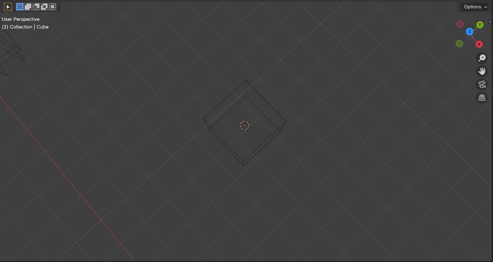

- > 读书是学习，使用也是学习，而且是更重要的学习。 常常不是先学好了再干，而是干起来再学习，干就是学习。——毛泽东《中国革命战争的战略问题》
- #think 干起来再学习！在实践中练，这是一个好手段，前提是已经有了最基本的概念，不能像无头苍蝇一样乱转。
	- 按照这个思路去学画画——用尽一切工具去把事情弄出来，再尝试一步一步增加难度，把事情弄好
- 大概以这个感觉去安排练习透视图中的物体的大小，这在50mm焦距上感觉是一个合理的距离
	- {:height 293, :width 545}
- #EE 什么是单片机（Single-Chip Microcomputer）
	- 单片机也叫MCU（Microcontroller Unit），指的是**集成在一个芯片上的微型计算机**，具体来说，它包括CPU、内存（RAM和ROM）、以及**外设**（比如定时器、ADC、UART等）。
	- 上面的**芯片**不是指的开发板——开发板包括电源线路，USB接口，各种引脚
	- 以前的一个误区是，以为单片机是特定的处理器型号或处理器架构，这个认识是错误的