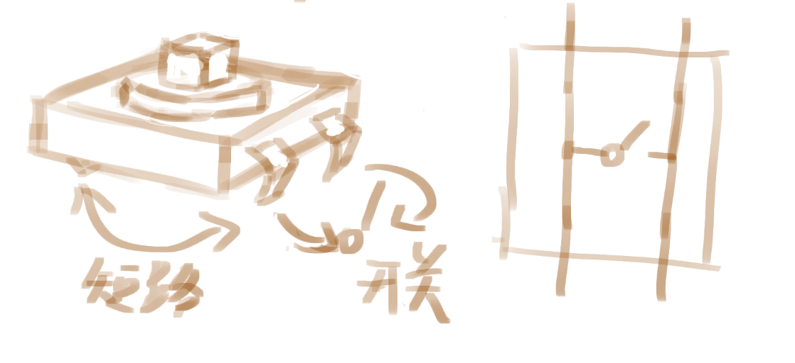

- DOING [[路线]]学习Arduino原理和实操
  :LOGBOOK:
  CLOCK: [2024-11-28 Thu 19:30:54]
  CLOCK: [2024-11-28 Thu 19:31:01]
  :END:
	- **基础部分:**
	  logseq.order-list-type:: number
		- ~~按钮切换灯泡亮灭~~
		  logseq.order-list-type:: number
		- ~~呼吸灯~~
		  logseq.order-list-type:: number
		- 各种中断的原理和使用，要解释硬件定时器和软件定时器的差异
		  logseq.order-list-type:: number
		- PWM，定时器和时钟，手写tone函数
		  logseq.order-list-type:: number
		- **数据持久化 (EEPROM和SD卡)** (增加一个小型数据记录项目)
		  logseq.order-list-type:: number
	- **传感器和执行器:**
	  logseq.order-list-type:: number
		- ADC，各种传感器（温度、湿度、光线等）
		  logseq.order-list-type:: number
		- 硬件滤波（要涉及到电路原理）
		  logseq.order-list-type:: number
		- 舵机 (使用Servo库)
		  logseq.order-list-type:: number
		- 数码管
		  logseq.order-list-type:: number
		- 显示屏 (例如LCD1602)
		  logseq.order-list-type:: number
	- **通信:**
	  logseq.order-list-type:: number
		- UART（串口通信）
		  logseq.order-list-type:: number
		- I2C
		  logseq.order-list-type:: number
		- SPI
		  logseq.order-list-type:: number
	- **综合项目:**
	  logseq.order-list-type:: number
		- 使用数码管实现一个简易电压表
		  logseq.order-list-type:: number
		- 使用显示屏实现一个示波器
		  logseq.order-list-type:: number
		- 12键钢琴，使用4x4矩阵键盘，另外4个键切换八度（会涉及到状态机等）-- 增加错误处理和数据持久化(保存当前八度)
		  logseq.order-list-type:: number
		- 可配置的节拍器（里程碑）-- 增加多种输出方式（例如LED，蜂鸣器，显示屏）, 数据持久化保存设置
		  logseq.order-list-type:: number
- #EE 元件 四角按钮，相邻的两个引脚由开关控制，相对的两个引脚直接相连
	- 
- #EE [[Arduino]] 按钮切换灯亮灭
  collapsed:: true
	- 剧透：这玩意儿不trivial，为了进行软件滤波，**必须用某种形式使用定时器**，无论是使用millis，delay，还是直接使用定时器中断。**但或许并不需要这么珍惜定时器资源**……
	- 初次会想着，这玩意儿不很简单吗？记录灯应该在的状态，每次按下时，切换该状态，并重设灯的电平。
	- ```C
	  void setup() {
	    pinMode(13, OUTPUT);
	    pinMode(5, INPUT_PULLUP);
	  }
	  int state = LOW;
	  void loop() {
	    if (digitalRead(5) == LOW) {
	      state = !state; // C中，!是逻辑否操作，!100 == 0, !0 == 1
	      digitalWrite(13, state);
	    }
	  }
	  ```
	- 这个操作是不太合适的，它一发现按钮按下就马上进行操作，这时候我如果持续按按钮，D13的电平会**反复切换**，因此实际电平是高低电平的平均值，**LED灯亮度会变暗**，而且有时候会**按失败**，按失败这点下面再说。
	- 这是因为，当前的代码直接粗暴地检查D5的状态，没有考虑到按下、抬起的情况，因此，**应当修改为检测上升沿（Rising Edge）或下降沿（Falling Edge）**——即原状态是低电平，现在状态是高电平这样。下面的代码去检查**下降沿**（因为抬起时高电平，按下时低电平）：
	- ```C
	  void setup() {
	    pinMode(13, OUTPUT);
	    pinMode(5, INPUT_PULLUP);
	  }
	  
	  int state = LOW;
	  void toggleLED() {
	    state = !state;
	    digitalWrite(13, state);
	  }
	  
	  int lastLevel = -1;
	  void loop() {
	    int currentLevel = digitalRead(5);
	    if (lastLevel == currentLevel) {
	      return;
	    }
	    if (lastLevel == HIGH && currentLevel == LOW) {
	      toggleLED();
	    }
	    lastLevel = currentLevel;
	  }
	  
	  ```
	- 这样实现的话失败的比例变少了，但仍旧存在。这是因为有**杂波**——按钮按下时会有**抖动**：电平并不是马上就稳定到低电平，而是**反复触发**，这可能是按钮内部的弹跳，也可能是其他原因，总之不能直接这么操作。
	- 解决方案可以是硬件上的也可以是软件上的，硬件上的话，就是给按钮并联一个电容去**滤波**，软件上的话，一个简单的解决方案是，检查到按钮被按下的时候，我delay一下，**等杂波过去**，然后再设置状态。**按钮抖动的时间通常以毫秒记**，所以这里延时10ms足够。
	- ```C
	    int currentLevel = digitalRead(5);
	    delay(10);
	    // ...
	  ```
	- 这个实现基本不会再有失败了。**但它使用了delay**，使用delay会阻塞占用CPU时间（而且内部会占用定时器）。delay内部使用了millis函数，我们可以直接在外部使用millis函数避免阻塞。
	- ```C
	  void setup() {
	    pinMode(13, OUTPUT);
	    pinMode(5, INPUT_PULLUP);
	  }
	  
	  int state = LOW;
	  void toggleLED() {
	    state = !state; // C中，!是逻辑否操作，!100 == 0, !0 == 1
	    digitalWrite(13, state);
	    tone(1, 1);
	  }
	  
	  int lastLevel = -1;
	  int lastMs = -1;
	  int DEBONUCE_MS = 10;
	  
	  void myLoop() {
	    int currentLevel = digitalRead(5);
	    int currentMs = millis();
	    if (currentMs - lastMs <= DEBONUCE_MS) {
	      return;
	    }
	  
	    if (lastLevel != currentLevel && lastLevel == HIGH && currentLevel == LOW) {
	      toggleLED();
	    }
	    lastLevel = currentLevel;
	    lastMs = currentMs;
	  }
	  
	  void loop() {
	    myLoop();
	  }
	  ```
- #EE [[Arduino]]呼吸灯
	- 呼吸灯这事儿倒很trivial——**修改占空比**即可，analogWrite函数就是为此而生的。
	- ```C
	  void setup() {
	    pinMode(11, OUTPUT);
	  }
	  
	  void loop() {
	    for (int i = 0; i < 256; i++) {
	  	// 电压范围是 0 - 255
	      analogWrite(11, i);
	      delay(10);
	    }
	    for (int i = 0; i < 256; i++) {
	      analogWrite(11, 255-i);
	      delay(10);
	    }
	  }
	  ```
- DOING [[Arduino]] 关于资源节省的指南
  :LOGBOOK:
  CLOCK: [2024-11-28 Thu 23:00:34]
  CLOCK: [2024-11-28 Thu 23:00:38]
  :END:
- DOING ADC即
  :LOGBOOK:
  CLOCK: [2024-11-28 Thu 23:19:16]
  :END: