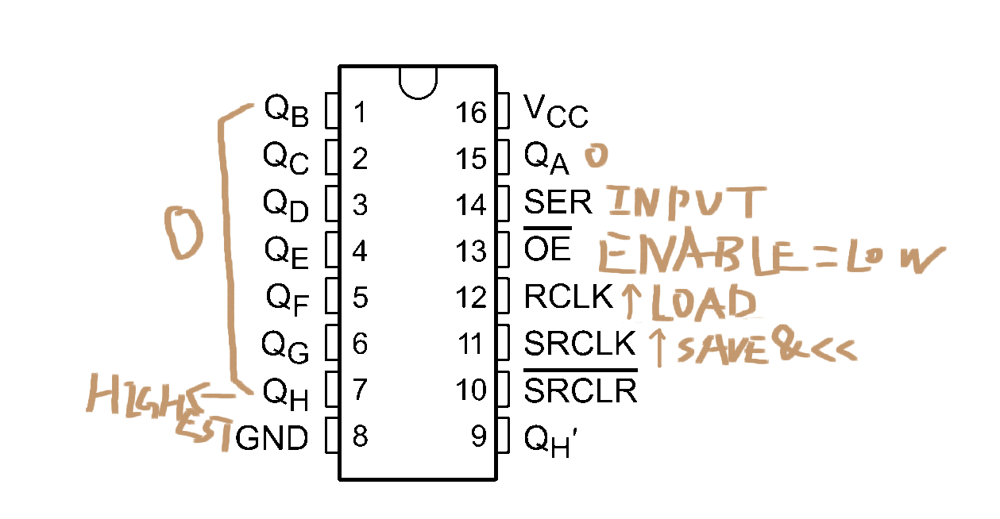

- #think 实验(experiment)的一般流程以及记录事项
	- 在实验前，设计实验，分析和预测实验结果（先有假设，才有结果，没有假设就直接做实验，属于是先射箭再画靶子）
	- 在实验中，记录数据、观测结果
	- 在实验后，分析和解释实验数据和结果
- DOING 今天用CRUMB点一下数码管，记录一下移位寄存器的使用，让我瞅瞅这玩意儿怎么还要tmd劳什子时钟。只用三个引脚！
  :LOGBOOK:
  CLOCK: [2024-11-30 Sat 01:41:28]
  CLOCK: [2024-11-30 Sat 01:41:31]
  :END:
- #EE 使用三个GPIO和三八译码器去驱动七段数码管（够复杂的！）
  collapsed:: true
	- ```C
	  // NUM -> bits
	  const uint16_t NUMS[] = { 
	    63,
	    6,
	    91,
	    79,
	    102,
	    109,
	    125,
	    7,
	    127,
	    111
	  };
	  
	  void setup() {
	    pinMode(10, OUTPUT);
	    pinMode(11, OUTPUT);
	    pinMode(12, OUTPUT);
	  }
	  
	  void printNum(int num) {
	    for (int i = 0; i <= 6; i++) {
	      if ((num >> i) % 2 == 1) {
	        digitalWrite(10, i % 2 == 1);
	        digitalWrite(11, (i >> 1) % 2 == 1);
	        digitalWrite(12, (i >> 2) % 2 == 1);
	        delay(1);
	      }
	    }
	  }
	  
	  uint32_t lastMill = -1;
	  int lastNum = 0;
	  void loop() {
	    printNum(NUMS[lastNum]);
	    uint32_t nowMill = millis();
	    if (nowMill - lastMill >= 500) {
	      lastNum = (lastNum + 1) % 10;
	      lastMill = nowMill;
	    }
	  }
	  ```
- #EE 关于芯片内部的处理时间
	- 如果时钟频率太高，芯片内部是有可能没处理完自己的业务的。时序芯片都会有自己的**最大时钟频率**，倘若时钟频率超出这个值，就会出现问题了。
- #EE [[元件]] 8位移位寄存器 74HC595
	- {:height 287, :width 551}
	- 移位寄存器是指，它既是寄存器，同时支持寄存的值进行左移右移，这样，便能够使用1bit的线传输8bit的数据，**时间换空间**。
	- 74HC595对每一位，有**两个**寄存器——**移位寄存器和输出寄存器**，输入的数据根据时钟`SRCLK`输入到移位寄存器并进行一次移位，然后根据时钟`RCLK`去将移位寄存器的值拷贝到输出寄存器，即**锁存**。
	- 有下面的引脚会常用：
		- $Q_H,...,Q_A$：输出引脚，高位到低位
		  logseq.order-list-type:: number
		- $SER$：输入
		  logseq.order-list-type:: number
		- $OE$：低电平为使能
		  logseq.order-list-type:: number
		- $RCLK$：时钟，上升沿加载移位寄存器的值到输出寄存器，即覆盖输出
		  logseq.order-list-type:: number
		- $SRCLK$：时钟，上升沿加载输入到移位寄存器，已有的值整体左移
		  logseq.order-list-type:: number
	-
- #EE [[为什么]] 仍旧需要门电路芯片和寄存器芯片，以及对它们的认识
	- 一个疑问是，既然已经有了单片机了，怎么还需要这种基础的门电路芯片和寄存器芯片？直接用单片机不就行了吗？
	- 我猜想一个原因是，单片机有几个引脚，就只能输出多少个二进制信号，而且这些二进制信号无法直接互相组合，比如做个三八译码器，理论上你能用三个引脚去控制八个LED是否发光，但结果呢？这三个引脚只能分别连接三个LED。其中信息量其实是相同的——控制八个中的一个，或者同时控制三个，但单凭单片机自己确实无法做到前者，需要各种门电路芯片和寄存器芯片做辅助，以及要辅以时序逻辑。
	- 总之，门电路和寄存器芯片（基础逻辑电路）存在的必要和好处在于：
		- 高性能，低延时，对高频应用，门电路比软件实现要快得多，因为门电路不需要像CPU那样进行指令的解码和执行，而且其执行是完全并行的，软件的优势在于通用性
		  logseq.order-list-type:: number
		- 信号（引脚）扩展，允许使用少量引脚控制大量外设，如移位寄存器，允许串行输入并行输出，**一个引脚达到八个引脚的效果**
		  logseq.order-list-type:: number
		- 降低程序复杂度，这个……后面再表。
		  logseq.order-list-type:: number
		- 芯片的输入电流极小，**对大部分芯片来说，输入电流和输出电流是隔离的（通过晶体管），输出电流来自芯片自己的电源**，这**能让一个引脚能够处理更大的负载**。
		  logseq.order-list-type:: number
	- 晶体管，撑起了大半个EE。
	- 但一个有趣的事情是，**芯片的输出极有时候在实际上可以是输入方**。一个典型的例子是使用移位寄存器芯片驱动共阳极的数码管，此时输出极为低电平的时候