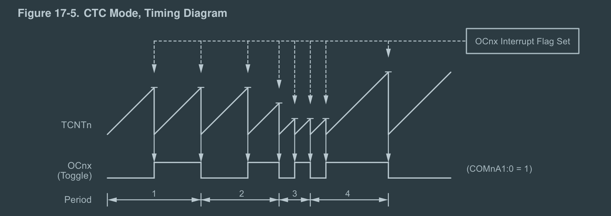
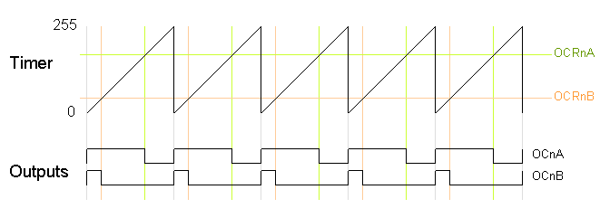
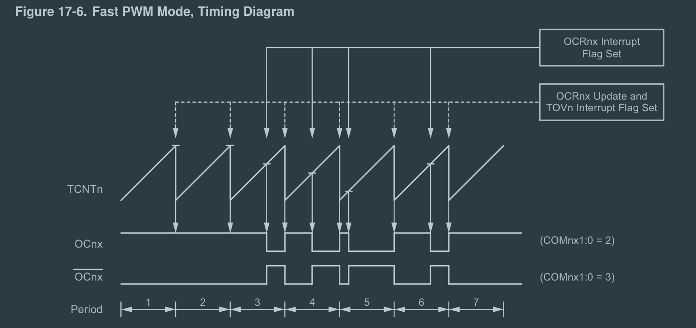
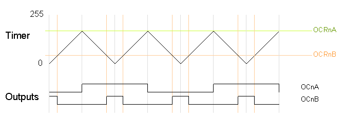
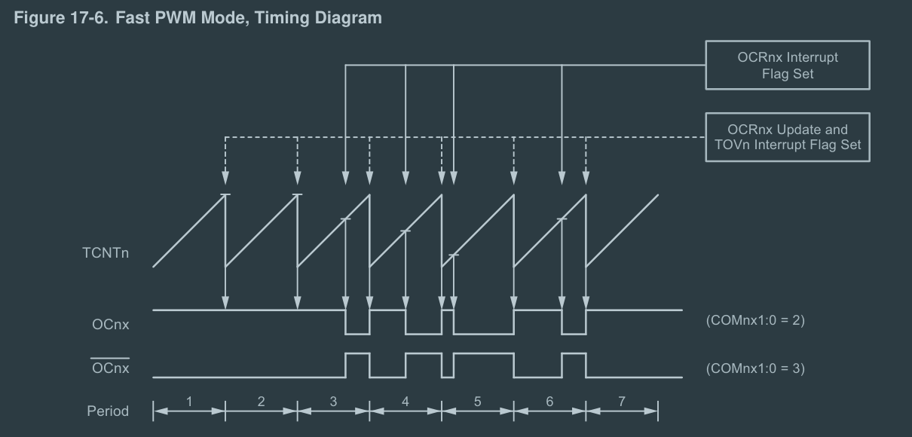

- #SQL #trick maxBy模式
	- 考虑有个用户发言记录表，我要获取每个用户最近的一条发言，其中要保证如果有多条发言在相同时间发送，取id最大的一条，该如何做呢？
	- 先不限制一个用户只获取一条信息的话，代码会是下面这样
	- ```SQL
	  select * from message where 
	  (user_id, create_time) in (select user_id, max(create_time) from message group by user_id)
	  ```
	- 如何做到呢？注意到，里层循环查询了用户ID和最大的创建时间，而根据这两个信息，可以再查出有着该用户ID和该创建时间的最大的ID，然后外面来个in就行了：
	- ```SQL
	  select * from message where 
	  id in (select id from message 
	         where (user_id, create_time) in 
	         		(select user_id, max(create_time) from message group by user_id))
	  
	  ```
	- 在SQL中，常见这样的需求，获取某字段最大的实体，其中，如果有多个实体的该字段同为最大值，选id最大的实体。一个例子是，获取最近创建的记录，其中如果多条记录创建时间相同，选ID最大的那一个
	- 这种需求显然可以用limit做，比如：
	- ```SQL
	  select * from student order by create_time desc, id desc limit 1
	  ```
	- 但倘若条件不支持这么做呢？万一用的DBMS在子查询中不支持使用order by，或者order by不起效呢？像oracle，需要使用ROWNUM，但ROWNUM必须对已排序完的查询操作，这会再增加一层嵌套。
	-
- 今天：
  :LOGBOOK:
  CLOCK: [2024-12-02 Mon 08:50:00]
  CLOCK: [2024-12-02 Mon 08:50:02]
  :END:
	- DOING 记录 maxBy sql pattern，问GPT有无其他pattern，或者从我之前的笔记中总结
	  :LOGBOOK:
	  CLOCK: [2024-12-03 Tue 00:12:21]
	  :END:
	- DOING 跑步！！或者室内健身如果天气差
	  :LOGBOOK:
	  CLOCK: [2024-12-03 Tue 00:12:11]
	  CLOCK: [2024-12-03 Tue 00:12:15]
	  :END:
	- DOING 画画！krenz！或者人体！不能闲着！
	  :LOGBOOK:
	  CLOCK: [2024-12-03 Tue 00:12:31]
	  CLOCK: [2024-12-04 Wed 00:29:55]
	  CLOCK: [2024-12-04 Wed 00:29:56]
	  CLOCK: [2024-12-04 Wed 00:30:09]
	  :END:
	- DOING 用74HC595为4个8段数码管写个计数器
	  :LOGBOOK:
	  CLOCK: [2024-12-04 Wed 20:23:13]
	  CLOCK: [2024-12-04 Wed 20:23:14]
	  :END:
	- DOING 学习PWM的配置，手动配置timer2，尝试一下各种配置
	  :LOGBOOK:
	  CLOCK: [2024-12-04 Wed 20:39:31]
	  CLOCK: [2024-12-04 Wed 20:39:32]
	  CLOCK: [2024-12-04 Wed 20:39:44]
	  :END:
	- DONE 学习PWM原理
	  :LOGBOOK:
	  CLOCK: [2024-12-04 Wed 20:39:24]
	  CLOCK: [2024-12-04 Wed 20:39:27]--[2024-12-04 Wed 20:39:28] =>  00:00:01
	  :END:
- #EE 关于PWM的参数和原理
	- {{embed ((67504505-209f-4cfe-9ba3-b1f328172ad4))}}
	- 参考资料：
		- ATmega328P Datasheet
		- [secrets-of-arduino-pwm](https://docs.arduino.cc/tutorials/generic/secrets-of-arduino-pwm/)
	- PWM即脉冲宽度调制Pulse Width Modulation，使用周期性的数字信号去模拟模拟信号。PWM**从使用者（外界）看来**，有这些参数：
		- 频率Hz，脉冲的频率，即每秒有多少个PWM周期（一个周期即从上升沿到下一个上升沿，或者从下降沿到下一个下降沿）。频率越高代表切换速度越快，越耗能（也就是说切换电平这个动作也会耗能）
		  logseq.order-list-type:: number
		- 占空比Duty Cycle，高电平在一个PWM周期（中所占的比例，占空比越大比例越大，50%时相等。占空比为1时即输出高电平，为0即输出低电平。占空比越高，**等效电压**越高
		  logseq.order-list-type:: number
		- 脉冲宽度Pulse Width，高电平的持续时间，频率-占空比-脉冲宽度之间任意两者可以计算出第三者。
		  logseq.order-list-type:: number
		- 周期Period，一个PWM周期的时间长度，频率的倒数
		  logseq.order-list-type:: number
		- 电压幅度Voltage Amplitude，高电平和低电平对应的电压
		  logseq.order-list-type:: number
		- 边缘特性Edge Characteristic，上升沿和下降沿的形状，通常不会是完美的方波
		  logseq.order-list-type:: number
		- 噪声Noise，**PWM总是会有一些噪声**
		  logseq.order-list-type:: number
	- PWM可以使用软件实现，但精度和稳定性会有问题，因此更多的是使用硬件PWM，要让硬件PWM工作，需要如下部分：
		- 晶振Crystal Oscillator，晶振是MCU的时钟源，是整个系统时钟的基础，它并不属于PWM，但是是PWM的基础；晶振的频率通常是MHz，如16MHz。
		  logseq.order-list-type:: number
		- 预分频器Prescaler，对晶振的高频进行分频，分频后的结果即是**定时器的工作频率**，如分频比如果是256，则$f_{\mathrm{定时器}}=\frac{16M\,\mathrm{Hz}}{256}={62.5k\,\mathrm{Hz}}$。预分频器的实现可以通过计数器，即检测到特定数量的时钟脉冲后复位，并输出一个脉冲。
		  logseq.order-list-type:: number
		- 定时器Timer：定时器是一个计数器，以工作频率递增；通常会使用定时器来代指PWM，而定时器只是PWM的一个关键组成部分。定时器一般有8位和16位。定时器可以设定为向上计数Up Counting，向下计数Down Counting和双向计数Up-Down Counting
		  logseq.order-list-type:: number
			- 注意，这里的计数法和PWM周期没有直接关系；比如假设工作模式是达到比较值后清零定时器，并翻转电平，这时候两次定时器清零后才是一个完整的PWM周期；假设工作模式是达到比较值后翻转，达到最大值，上溢后再次翻转，这时候一次定时器清零就是一个完整的PWM周期。显然，**前者的占空比总是50%，后者可以通过调整比较值去调整占空比**。
		- 比较器Comparator：比较定时器和**比较值**，即在软件中规定的一个值，计数器达到比较值时，能够做特定操作，如清零定时器，翻转电平（并清零定时器或者继续计数）等；这里做的操作代表的就是定时器的**工作模式**。对特定的操作，调整比较值可以调整输出的频率和占空比。
		  logseq.order-list-type:: number
	- 考虑8位定时器向上计数，比较值设置为最大值（因此上溢时翻转电平），此时这时候每256x2个定时器周期等于一个PWM周期，定时器工作频率是${62.5k\,\mathrm{Hz}}$，因此有：
	  id:: 674fc8da-9d84-4eae-a3e0-557eac271eac
		- $$f_{\mathrm{PWM}}=\frac{62.5k\,\mathrm{Hz}}{256 \times 2}=122\,\mathrm{Hz}$$
		- 能够发现，**顶值越高，PWM频率越低**，该定时器最低只能设置122Hz的PWM频率。
		- 也能够发现，比较值越接近最大值，**在相同的比较值变化量下**频率的变化越小，反者来说，使用PWM输出这些频率时会相对来说更精确一些。
	- 预分频器，计数方式，比较值都是可以调整的，因此**PWM频率和占空比均可被调整**。
	- 工作模式大体分为两类——**PWM模式：调整占空比以模拟模拟电压；定时中断模式：调整频率以模拟特定频率波形（如音频，定时中断）**。
	- **在Arduino中，每个定时器和两个引脚相连，它们能够有自己的比较值，这就是说，它们频率相同，但占空比可以不同。**。考虑Arduino Uno的Timer2，它是8位的。
	- Timer2它有4个模式，前两种属于定时中断，后两者属于PWM模式（参照ATmega328P数据手册17.7节）：
		- 正常模式，不设置比较值（或者说，比较值为最大值），溢出时中断；**无法输出硬件波形**，常用于定时执行任务、中断。硬要画出波形图的话，就是下面的CTC的图像比较值始终设为最大
			- 正常模式没有参数，
		- CTC模式（Clear Timer On Compare Match），到比较值时中断并清零；使用CTC模式允许通过调整比较值调整频率，但占空比始终为50%。
			- CTC模式的参数为比较值
			- 
		- 快速PWM模式Fast PWM，从0到最大值，计数器大于等于比较值时翻转，上溢时翻转。
			- 
			  id:: 67504505-209f-4cfe-9ba3-b1f328172ad4
			- FastPWM的参数为比较值
			- 
		- 相位矫正PWM则是从0到最大值，再回到0，计数器越过比较值时翻转，因此总是每个周期中波形都是中心对称的
			- 
			- 相位矫正PWM的参数也为比较值
			- 
		-