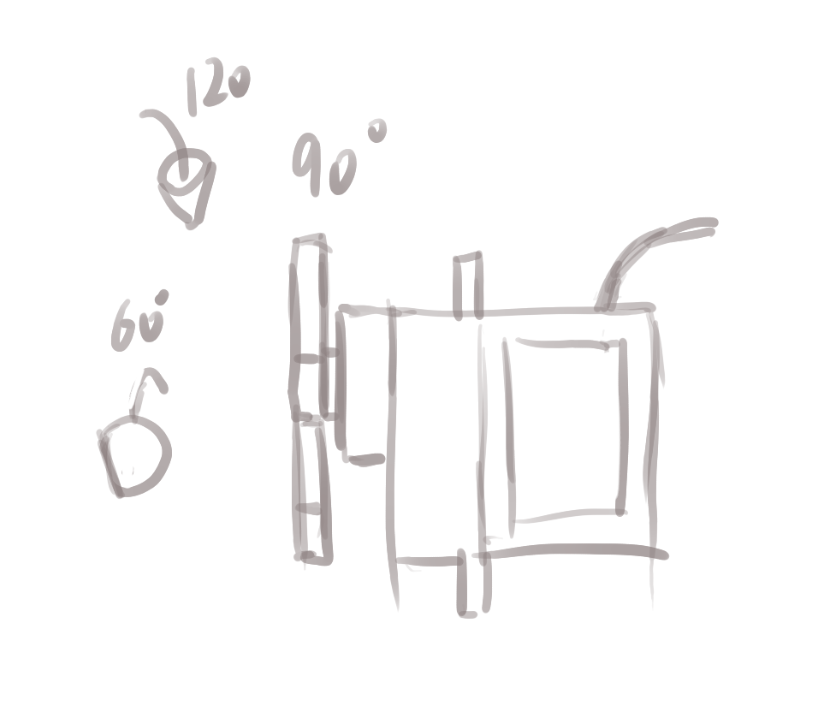
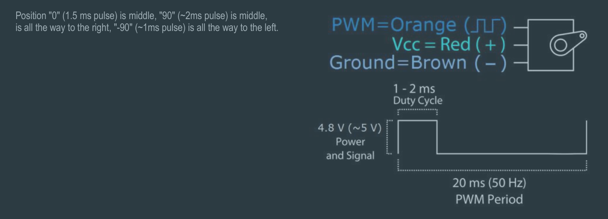

- 今天：
	- DOING 画画！krenz！或者人体！不能闲着！
	  :LOGBOOK:
	  CLOCK: [2024-12-03 Tue 00:12:31]
	  CLOCK: [2024-12-04 Wed 00:29:55]
	  CLOCK: [2024-12-04 Wed 00:29:56]
	  CLOCK: [2024-12-04 Wed 00:30:09]
	  :END:
	- DOING 跑步！！或者室内健身如果天气差
	  :LOGBOOK:
	  CLOCK: [2024-12-03 Tue 00:12:11]
	  CLOCK: [2024-12-03 Tue 00:12:15]
	  :END:
	- TODO 学习PWM的配置，手动配置timer2，尝试一下各种配置
	  :LOGBOOK:
	  CLOCK: [2024-12-04 Wed 20:39:31]
	  CLOCK: [2024-12-04 Wed 20:39:32]
	  CLOCK: [2024-12-04 Wed 20:39:44]--[2024-12-05 Thu 08:54:48] =>  12:15:04
	  :END:
- #EE 舵机 SG90
	- 舵机工作在50Hz下，调整占空比调整角度，下面是我准备使用的约定
	- {:height 363, :width 445}
	- {:height 222, :width 550}
- #EE #snippet/Arduino 两个74TC595芯片控制4个数码管
	- 高8位的后四位用来选数码管，低8位用来对应数码管的各段。
	- ```C++
	  #include <Arduino.h>
	  #include <LedControl.h>
	  
	  const auto DIN_PIN = A0;
	  const auto RCLK_PIN = A1;
	  const auto SRCLK_PIN = A2;
	  
	  // NUM -> bits, 1 == LIGHT
	  const uint8_t NUMS[] = { 
	    63,
	    6,
	    91,
	    79,
	    102,
	    109,
	    125,
	    7,
	    127,
	    111
	  };
	  
	  // 认为SER和单片机相连的这个595芯片是低8位，所以下面要先输入高8位再低8位
	  void replaceValue(uint8_t addr, uint8_t value) {
	      // 再输入高8位
	      shiftOut(DIN_PIN, SRCLK_PIN, MSBFIRST, addr);
	      // 先输入低8位
	      shiftOut(DIN_PIN, SRCLK_PIN, MSBFIRST, value);
	    // 手动触发RCLK的上升沿 
	      digitalWrite(RCLK_PIN, LOW);
	      digitalWrite(RCLK_PIN, HIGH);
	  }
	  
	  void printNum(uint16_t v) {
	      int n_0 = v % 10;
	      int n_1 = (v / 10) % 10;
	      int n_2 = (v / 100) % 10;
	      int n_3 = (v / 1000) % 10;
	      replaceValue(1, ~NUMS[n_0]);
	      replaceValue(2, ~NUMS[n_1]);
	      replaceValue(4, ~NUMS[n_2]);
	      replaceValue(8, ~NUMS[n_3]);
	  } 
	  
	  void setup() {
	      pinMode(DIN_PIN, OUTPUT);
	      pinMode(RCLK_PIN, OUTPUT);
	      pinMode(SRCLK_PIN, OUTPUT);
	  }
	  
	  void loop() {
	      printNum((millis() / 100) % 9999);
	  }
	  ```