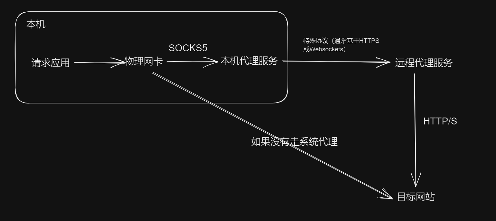
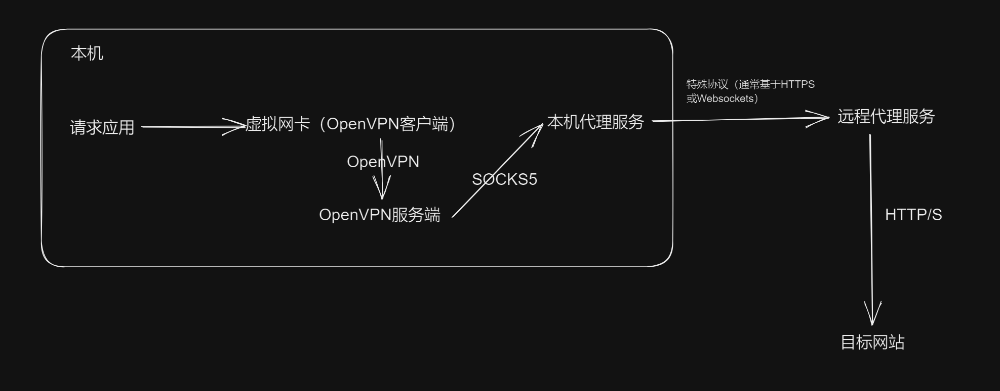

- DOING 研究 系统代理，VPN，网卡，虚拟网卡，这些东西是怎么运作的，关系是什么
  :LOGBOOK:
  CLOCK: [2024-12-18 Wed 09:37:43]
  :END:
	- 代理
	- win系统代理
	- linux系统代理
	- VPN
	- 网卡
	- TUN，TAP，虚拟网卡
	- V2ray
	- 代理协议
	- TUN
- # 关于使用代理工具时，一个网络请求的流转过程
	- 使用SOCKS5代理时：
		- 如果目的地是域名，使用DNS协议找到IP（这一步也会发起网络请求！这里的风险称为DNS泄露；现代的DNS服务器都支持DNS over HTTPS，即使用HTTPS协议去发送DNS请求，从而避免中间的信息泄漏）
		  logseq.order-list-type:: number
		- 系统根据系统路由表，根据IP找到要使用的网卡（或虚拟网卡）
		  logseq.order-list-type:: number
		- 使用该网卡向该IP发起连接（TCP/UDP，HTTP等）
		  logseq.order-list-type:: number
		- 数据会先打到SOCKS5代理端口，代理工具将其转发给目标
		  logseq.order-list-type:: number
	- 注意上面直接使用代理时，需要配置**系统代理**才能让系统知晓该代理；Windows从界面上只支持配置HTTP代理，SOCKS5代理需要使用注册表等手段去配置。而且配置了系统代理不代表所有请求都走代理，为了满足这一点，必须使用**TUN模式**——创建虚拟网卡，让所有流量都走它。
	- 
	- 使用SOCKS5代理，同时使用OpenVPN以实现全局代理时：
		- 同上，找到IP，找到要使用的网卡（在这里是OpenVPN**客户端**创建的虚拟网卡；OpenVPN客户端会根据配置去修改路由表，添加相应路由）
		  logseq.order-list-type:: number
		- 使用该网卡向该IP发起连接（任何协议均可）
		  logseq.order-list-type:: number
		- 数据会先打到OpenVPN的**服务端**，服务端根据配置去访问SOCKS5代理，再去转发给目标
		  logseq.order-list-type:: number
	- 
	- 注意这里有一个严重的问题——OpenVPN服务端发送请求时，也是依据的系统路由表，如果客户端配置所有流量全部走代理，那就歇逼了——服务端发送的流量也会走同一个路由表，结果会**打到客户端**上。为此，要么让服务端不和客户端分在一起，要么不代理全部流量。
	- 关于OpenVPN的路由相关配置，客户端可以通过route命令指定哪些路由去转发给服务端，该配置将修改本机的路由表；服务端也能通过push命令主动向客户端去推送路由（毕竟客户端不一定知道自己要去代理哪些）