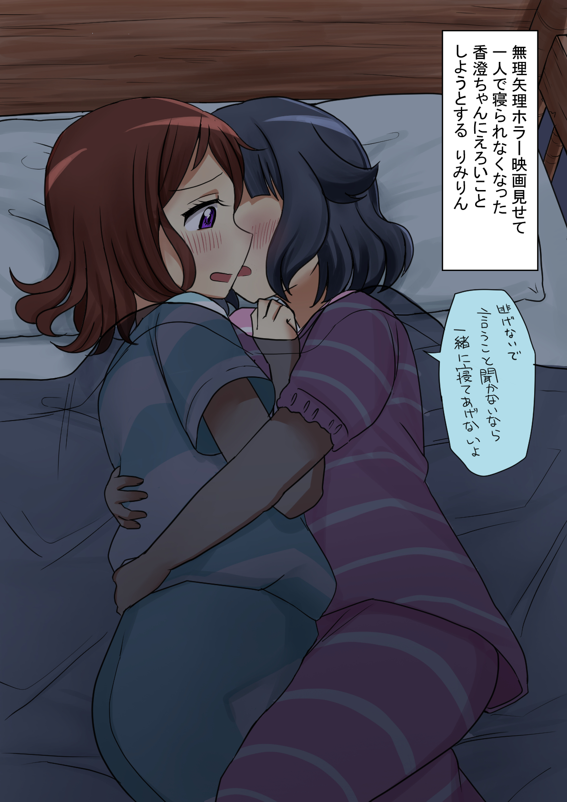
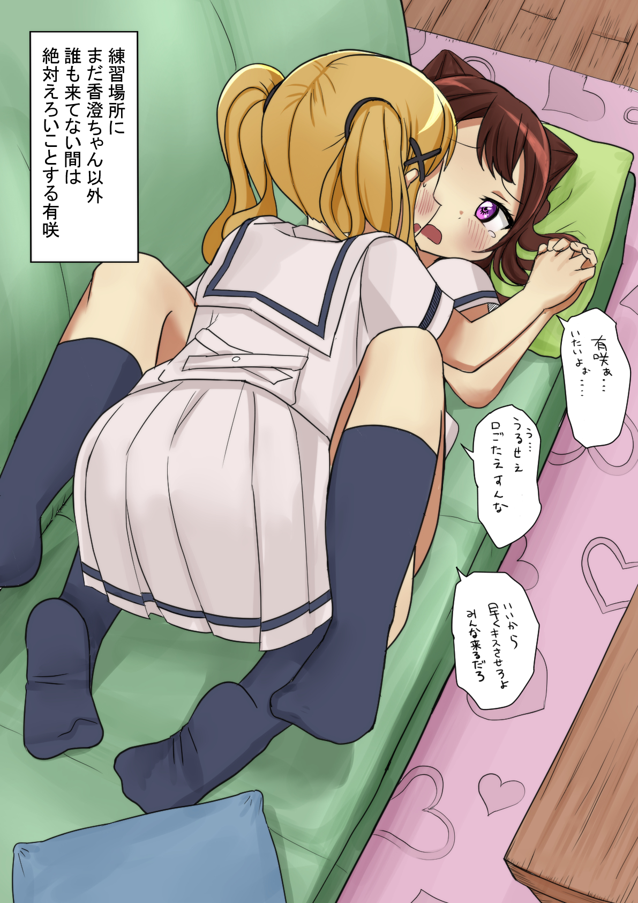

- DOING Krenz透视第一周（今年的第一步！不能把它给搞砸喽！主席在看着我呢！）
  DEADLINE: <2025-01-12 Sun>
  :LOGBOOK:
  CLOCK: [2025-01-02 Thu 00:19:13]
  CLOCK: [2025-01-02 Thu 00:19:22]
  CLOCK: [2025-01-02 Thu 00:19:38]
  :END:
	- 描述：在接下来的7天中，学习Krenz的透视课程第一周，做笔记，认真完成所有布置的作业并保证满足作业要求；完成作业后再次检查笔记，综合实践经验去查漏补缺
	- 子任务：
		- 再次快速把视频过一遍
		  logseq.order-list-type:: number
		- 再次快速把之前做过的笔记过一遍
		  logseq.order-list-type:: number
		- 检查所有要做的作业，把目标、资源先整理好方便后面直接开做
		  logseq.order-list-type:: number
		- 检查作业目标，预先判断做作业的大致步骤和注意事项（就像做实验一样，先预测，再操作，根据实验结果再反思）
		  logseq.order-list-type:: number
		- 完成所有作业
		  logseq.order-list-type:: number
		- 反思，再次把笔记过一遍，根据实践经验去查漏补缺
		  logseq.order-list-type:: number
- #绘画/画师 pid=100899057，总受KSM，色疯了
	- 我挺喜欢看这种的……好乐，像虹咲啊HBR啊感觉都可以画这种的
	- 
	- 
	- 
	- 