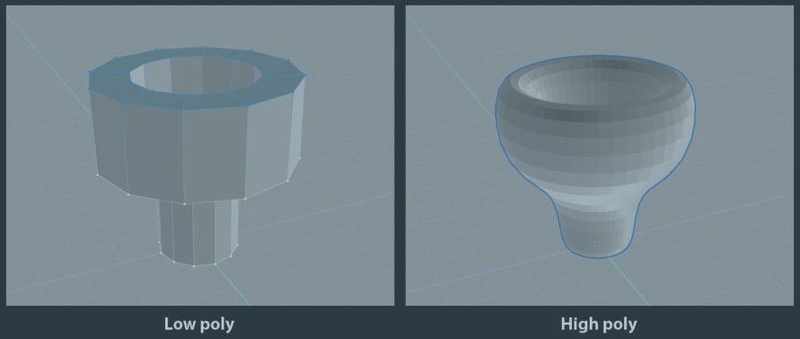

- Modifier是对象的属性，它提供**非破坏性编辑**功能，就像图层蒙版，**可插拔**。同时它也可以`apply`，把自己的效果永久地应用到对象上，但做这事儿之前应当做备份。
- Modifier在Properties Editor中管理，选择Mesh Object后，能看到一个扳手图标，那里就是Modifier。可以有多个Modifier，它们**应用的顺序从上到下**。Modifier可以设置在Edit Mode，viewport和render时的可见性，对象在Outlines中也可以调整后两者。
- 下面学习各种不同的Modifier。Modifier的话关键就在于它的各种**配置项**了。
- ## 细分曲面 Subdivison Surface
- 可能是最常用的修改器之一。细分曲面为选择的多边形添加一大堆新面以对多边形进行**平滑**。
- **一个常见的建模工作流是先从低多边形的版本开始，然后再增加它的多边形数量**。
  id:: 6712fc8d-bce2-4ecb-a932-772005db4d35
- 