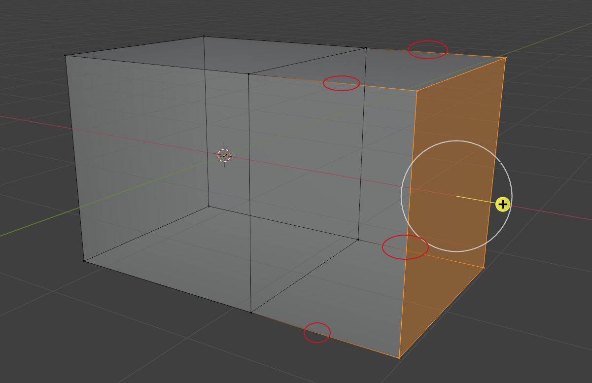

- #Blender 这篇开始就更多地关注理论了，常用的快捷键在前面已经学习地比较熟悉了。
- **对象有多种类型**，不同类型会包含不同类型的数据：
	- 网格Mesh，多边形模型，由顶点，边和面组成
	  logseq.order-list-type:: number
	- 集合Collection，顾名思义；注意集合的Active和其他对象的Active是分开的，新增的对象总是增加到Active的Collection，而当前选择的对象所属集合不一定是Active的。左上角也会写上当前Active的Collection；快捷键`M`允许快速移动对象到特定Collection。
	  logseq.order-list-type:: number
		- 此外，Collection在导入其它blend文件时也会有意义，用户能直接导入整个Collection或导入部分对象。
	- ……其他类型，如Curve，Surface，Camera等
	  logseq.order-list-type:: number
- 编辑操作允许对对象的数据进行编辑。如果说对象模式主要是布置场景和对对象进行变换的话，**编辑模式主要是用来编辑Mesh**，更具体地说，是编辑Mesh对象的顶点Vertex（复数是Vertices），边Edge和面Face，它们都可以是编辑的元素，但最本质上，它们**编辑的都是点集**，只不过线和面包含多个点罢了（对工具的心智模型可以这么建立吗？）。编辑模式会提供多种工具来进行编辑。
- 在编辑模式下，能够选择去编辑点或线或面，**但按住`Shift`再选择的话可以同时编辑点线面中一个或多个**，这个注释写的很清楚。选择了特定点线面后，便能够使用变换和其他左侧看到的工具去进行建模操作了。
- 在编辑模式下能够选择物体的点、线、面，**这里的“选择”和对象的Active或Selected在行为上很多是一样的**（从这个角度出发，我们选择一整个对象的时候，实际上是选择了物体的所有点）——可以通过`反引号键`和`Shift-S`菜单去让镜头聚焦选择的点线面。**通过这种方式，我们能够将3D Cursor置于对象的点，线和面上**。当我们需要对齐对象时，我们总应当使用这种方式来最精准地对齐。
- 建模时可以用X光模式（右上角按钮，或者`Alt-Z`），从而能选择到物体不可见部分的点线面，此时适合用框选`B`的方式去进行选择。
- ## 对象原点origin
- 对象有一个原点**作为其移动，旋转和缩放的根据**，对象的位置也是按原点位置去标识的，正方体的原点默认在体的正中心。**可以通过3D Cursor设置对象原点**，只需右键对象然后`Set Origin-Origin to 3D Cursor`。
- 原点对编辑很有用——想象你调整一个放置在地面上的物体的大小，此时如果原点仍旧是物体的中心，放大后物体下面就会和地面重叠了，而如果原点正好在物体的底面上，则放大后仍旧好好地置于地面上。**原点究竟放到哪里要根据建模任务的需要**。
- # 建模Modeling
- 建模更具体来说是叫多边形建模polygon modeling。从建模的角度出发，可以认为对象是一个顶点集合和线集合组成的**线框**，**面就是一堆线首尾相连包围而成的东西**，而非数学上的平面——这带来一个重要的点：**面可以不是平的**，但实际操作中似乎应当保证面是平的，不然渲染结果会受影响（因为法线之类的东西算不对）。
- DOING 在这里插入总结——建模有哪些类型的工具，负责怎样的业务，使用的心智模型之类的
  :LOGBOOK:
  CLOCK: [2024-10-14 Mon 16:50:23]
  CLOCK: [2024-10-14 Mon 16:50:27]
  :END:
- ## 挤出Extrude
- **Extrude是最常用的多边形建模工具**，它的行为是**复制选中的元素，并将复制后的元素和原来的元素一一对应连接上**，下图就是他的效果，连接线用红圈标出来了。Extrude按+号时会**按法线方向**把复制后的元素进行移动，但也可以不理会它，任意去移动。
- 这里并非是完全地复制——能够观察到，如果一个点周围所有点都被选择了，此时进行extrude时，它不会被复制而是被移动……总之不用关心这种细节。
- 关于法线方向，Blender会根据点旁边的三个面和线旁边的两个面去计算点、线的法线方向。
- {:height 517, :width 761}
-