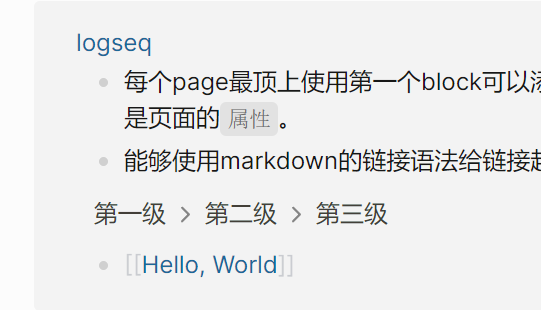
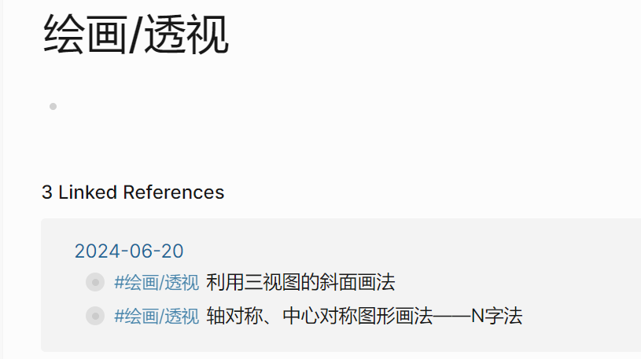

- #配置 logseq 的一些问题和 tips
  collapsed:: true
	- 原文 <https://www.jianshu.com/p/4e9298c85a04>
	- # logseq 使用 tips
	- ✨配合everything引用硬盘中任意位置的文件
		- ❓问题
			- logseq目前的附件管理能力较弱
			- 如果直接引用logseq文件夹外的文件，需要使用绝对路径，跨机器同步之后路径容易失效
		- 🚩方案
			- 使用everything的自有协议作为超链接，点击链接后直接打开everything在本机硬盘搜索相应文件名
			- 设置方法：everything中，选项→常规→勾选「支持URL协议」
			- 使用方法：需要引用硬盘上某个文件时，直接定义超链接`[描述](es://文件名)`
	- ✨Excalidraw画笔偏移bug的临时补救措施
		- ❓问题：logseq中用`/draw`指令绘制excalidraw时，画笔偏离鼠标位置，功能基本不可用
			- [据说此bug是excalidraw自身问题](https://links.jianshu.com/go?to=https%3A%2F%2Fgithub.com%2Fexcalidraw%2Fexcalidraw%2Fpull%2F4806)，[并且已经修复](https://links.jianshu.com/go?to=https%3A%2F%2Fgithub.com%2Flogseq%2Flogseq%2Fissues%2F4270%23issuecomment-1064708580)，只是logseq没有跟进
		- 🚩方案：`/draw`指令生成excalidraw画布后，点击画布所在block的小圆点，聚焦到block里，画笔偏移的问题就不会出现
	- ✨`WAITING` 任务状态
		- 目前支持的除了`TODO`、`DOING`、`NOW`、`LATER`四种任务状态外，还存在`WAITING`、`CANCELLED`/`CANCELED`、`DONE`三种隐藏状态，需要手动输入关键字或者通过slash命令快捷输入，但不能直接通过快捷键操作。
	- ✨设置date picker的一周起始日
		- 默认一周从周日开始，无法设置。但其实某次PR中已经加入了隐藏设置功能。在配置文件`config.edn`中加入`:start-of-week 0`就可以设置成周一为每周第一天。
			- [Add support for change start of week in calendar by shady2k · Pull Request #913 · logseq/logseq · GitHub](https://links.jianshu.com/go?to=https%3A%2F%2Fgithub.com%2Flogseq%2Flogseq%2Fpull%2F913)
- # Logseq 基础
	- # Logseq 是啥
		- 注意这里的组织方式！这里模仿了官方文档中的操作，每个section的内容都缩进为标题的子孙（多级标题也同样缩进），这是否使得能更方便地组织和操作结构？
		- **Logseq** 是一个**大纲编辑器**，每个自然段（前面一个点去标识的玩意儿）都是（大纲的）一个`块 block`，[[原子]]。但块，以及块的集合——称为`页面page`——之间能够方便地互相引用。有点像维基，最终得到的效果是网状的而非树状的。虽然这么说，但似乎引用更多的是对page而非block，尽管page本质上只是个block的集合。
		- 注意嵌套关系——`图Graph` -> `页面page` -> `块block`，页面可以有层级关系，比如`hello`和`hello/world`，这两者都是单独页面，之间会有一种特殊的链接关系、
		- 在最开始使用logseq时，不需要太关心结构，结构在使用中会自己浮现，但至少关于双链笔记的概念需要熟悉..
		- 对我来说，Logseq用来组织跨领域（跨领域！希望它能让我把所有东西都串起来，绘画，音乐，哲学，计算机）的知识网，代码片段，以及学习相关的TODO。
	- # Page Link
	  collapsed:: true
		- > Link, Link! Wake up! LMAO
		- 从一个页面链接到另一个页面时，实际上创建了两条链接——从本页面到另一个页面的链接，语法为`[[页面名]]`或`#页面名`，前者用于行内链接，后者更像元数据；以及从被链接的页面中的`Linked Reference`部分中到本页面的链接。
		- 但在另一个页面中提到本页面的名称时，如果没有链接，它会显示在`Unlinked References`中。
		- > 实际上这里可以为每个术语都创建个页面去描述它吧？但是感觉没必要，它们并不关键且容易记忆。
		- 总是利用logseq的补全功能去创建链接，保证任何链接总是有个入口。
		- 能够使用markdown的链接语法给链接起别名，比如 [这样]([[Hello, World]])，`[这样]([[Hello, World]])`。
		- 每个page最顶上使用第一个block可以添加别名，语法如：`alias:_ HW`，[[HW]]，这里的`_`需要替换成`:`因为我没研究出来它怎么转义。该语法实际上是页面的`属性`。
	- # Indentation
	  collapsed:: true
		- Block可以有嵌套关系，每次按Tab都会增加一层缩进，该Block就是上一个Block的Child。
		- 点击Bullet能让视图聚焦到特定Block（而非Page），此时该Block就是当前的顶层元素（此时只能有一个顶层元素），所有其他Block都是它的子孙。
		- Indentation很重要——链接到其他Page时，在该Page的链接引用中将看到整个继承层级，比如这里在多次嵌套后引用HelloWorld页面，跳转到HelloWorld页面就会看到：
		- 第一级
			- 第二级
				- 第三级
					- 第四级同级
					- [[Hello, World]]
		- 
		- 其实这还蛮抽象的hhhh，一个好用的点是很容易利用嵌套去在日志中组织和折叠内容，避免内容太多，此时第一级就像是标题一样的存在：
		- 
		- {:height 465, :width 815}
	- # Block Link
	  collapsed:: true
		- Block没有名字，只有一个唯一的ID，要引用一个Block，右击Bullet，点击`拷贝块引用 Copy Block Ref`便会连带引用语法去拷贝块的地址，粘贴它便完成块的引用。
		  id:: 66742fd6-965a-49b5-94ae-c112cd27dec9
		- 就像这样，语法为`((块ID))` ((66742fd6-965a-49b5-94ae-c112cd27dec9))
		- 块引用主要是为了避免重复。
	- # 引用和嵌入
		- 要链接上其它Page或页面，不仅可以用引用，也可以用嵌入，嵌入的语法形如 `{{embed <块引用或页面引用>}}`，`/`命令中有其snippet。
		- {{embed [[logseq]]}}
		- 看起来logseq还算聪明，递归引入不会渲染更嵌套的引用hh
		- 引用和嵌入的区别在于，引用只是一种超链接，只做跳转作用，而嵌入是直接把原页面或块的内容，包括其子孙引用过来，就像编程语言中的引用一般，修改嵌入的内容会直接反映到其对应的页面或块。
- # 活用 Logseq
	- TODO ！
	  :LOGBOOK:
	  CLOCK: [2024-06-22 Sat 22:35:34]--[2024-06-22 Sat 22:35:35] =>  00:00:01
	  :END:
	- #trick 嫌弃logseq没有多窗口？我只想看看这标签里是啥，不想切过去？按住 `Shift`点击链接、块以在侧边栏中打开它。
-