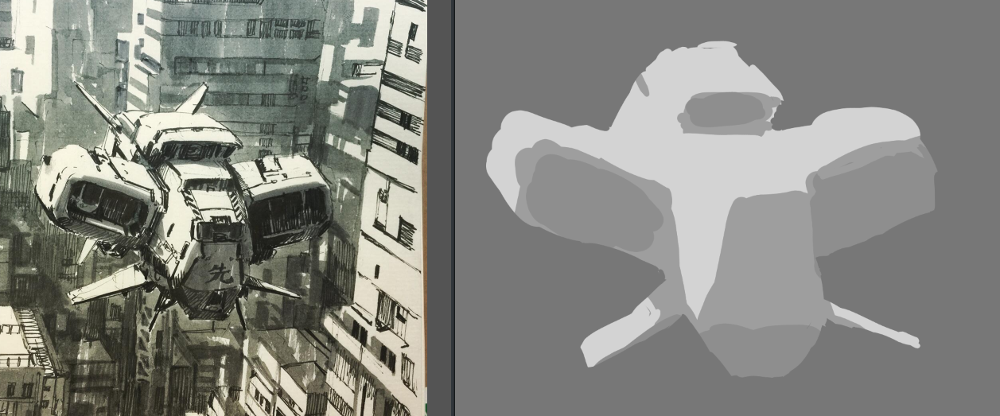

# 2024年
	- ## 年目标
		- 画画，要养成画画的习惯，**有趣的东西都要画画**！**手不要闲着**！
		  logseq.order-list-type:: number
			- **不要闲着！！！**
		- 减肥！
		  logseq.order-list-type:: number
	- ## 11月
		- 继续坚持跑步和画画！这次画画就不定时间了，定数量目标：
			- 总结灭点距离和焦距的关系（不知道锚点究竟在哪里…………甚至不知道究竟有没有这种银弹）
			  logseq.order-list-type:: number
			- 总结人体的两层抽象——bean和landmark
			  logseq.order-list-type:: number
			- 学习人体的几何体抽象，并且能够使用blender去进行相应的建模。
			  logseq.order-list-type:: number
			- 找到几何体透视练习法子并持续练习
			  logseq.order-list-type:: number
			- 找到人体速写练习模式
			  logseq.order-list-type:: number
			- 跑步80km！`0 / 60km`
			  logseq.order-list-type:: number
			- 找到力量训练的模式，每天先做力量训练再跑步
			  logseq.order-list-type:: number
			- 最长的一次要跑到10km，且70分钟往上！`7 / 10 km` `60 / 70 min`
			  logseq.order-list-type:: number
	- ## 10月
		- 这个月主要目的是开始锻炼，然后开始画画...很搞笑这人生。
			- 画画40小时！`9 / 40`
			  logseq.order-list-type:: number
			- ~~运动，最长一次要跑到5km并保持：`6km / 5km`~~
			  logseq.order-list-type:: number
			- ~~运动！这个月跑完40km！当前：`37km? / 40km`~~
			  logseq.order-list-type:: number
		- ## 10.7-10.13
			- 练习典型简单几何体的绘制，类似下图（这个我驾驭不了！）的练习，先单体，要考虑模拟各种现实情况的几何体（比如下图的机头，下部往内收了，这就是一种可能出现的情况，如鼻子底部的转折）
			  :LOGBOOK:
			  CLOCK: [2024-10-07 Mon 23:57:32]
			  CLOCK: [2024-10-07 Mon 23:57:34]
			  CLOCK: [2024-10-07 Mon 23:57:43]--[2024-10-08 Tue 00:02:29] =>  00:04:46
			  CLOCK: [2024-10-08 Tue 00:02:38]
			  :END:
				- > 后面考虑，应该不能这么干，我应该**先找着参考再去画**，不要上来就直接写生
				- 练习实际上会涉及到两个领域——透视和光影，这里顺便要练习结构翻转。
				- 先单体后多体，先平面后曲面，先简单后复杂（简单点就是几何体，复杂点就是人头，工业造型等），等复杂到特定程度后就该练习抽象和概括了，最复杂的程度的话……就是V大飞行器，棱角比较分明的步行机甲等。
				- {:height 139, :width 439}
	- ## 9月
		- 很失败，很失败
		- 减肥，最高体重低于 145。`149 / 145`
		  logseq.order-list-type:: number
		  :LOGBOOK:
		  CLOCK: [2024-09-01 Sun 19:10:01]
		  CLOCK: [2024-09-01 Sun 19:10:04]--[2024-09-27 Fri 00:09:35] =>  604:59:31
		  CLOCK: [2024-09-27 Fri 00:09:36]--[2024-09-29 Sun 21:35:43] =>  69:26:07
		  CLOCK: [2024-09-29 Sun 21:35:44]
		  :END:
		- 60小时，60小时！ `2.5 / 60`
		  logseq.order-list-type:: number
		  :LOGBOOK:
		  CLOCK: [2024-09-01 Sun 19:19:23]
		  :END:
		- 专利
		  logseq.order-list-type:: number
		  :LOGBOOK:
		  CLOCK: [2024-09-12 Thu 16:16:58]
		  CLOCK: [2024-09-12 Thu 16:16:59]
		  :END:
			- 把RAG和web应用结合，做数据分析挖掘？
			  logseq.order-list-type:: number
			- Agent做API网关，集成语音识别，让用户通过自然语言完成多系统之间协调工作，如通过地图API查询附近酒店、通过美团API下单，通过微信支付？
			  logseq.order-list-type:: number
		- 研究SD，做笔记
		  logseq.order-list-type:: number
		  :LOGBOOK:
		  CLOCK: [2024-09-01 Sun 19:20:07]
		  CLOCK: [2024-09-01 Sun 19:20:09]
		  :END:
			- 遵循这样的原则：
			  logseq.order-list-type:: number
				- 我当前是绘画初学者，将来的目标是成为画师，学习SD的终极目标是为了帮助学习绘画，以及在将来集成到工作流中，提高绘画效率。AI画出来的东西不是你的。
				  logseq.order-list-type:: number
				- 从使用者的角度出发去学习，对各种概念主要是从用的角度出发去了解，建立心智模型也是从用的角度；主要关注现象，只有在必要时再关注原理
				  logseq.order-list-type:: number
				- 首先熟悉webUI，再熟悉comfyUI
				  logseq.order-list-type:: number
				- 首先熟悉基础概念，再熟悉更深入的东西，比如工作流，实时绘画，甚至是SD的原理
				  logseq.order-list-type:: number
			- 把所有基础概念都过一遍，做做笔记（
			  logseq.order-list-type:: number
			  :LOGBOOK:
			  CLOCK: [2024-09-10 Tue 16:27:48]
			  CLOCK: [2024-09-10 Tue 16:27:56]--[2024-09-10 Tue 16:41:52] =>  00:13:56
			  CLOCK: [2024-09-10 Tue 16:41:52]--[2024-09-10 Tue 16:41:53] =>  00:00:01
			  CLOCK: [2024-09-10 Tue 16:42:39]
			  :END:
			- 研究prompt编写的一般论，有能力自己编写满足需要的prompt（或者至少知道该怎么问），做笔记
			  logseq.order-list-type:: number
			  :LOGBOOK:
			  CLOCK: [2024-09-10 Tue 16:29:45]--[2024-09-10 Tue 16:41:49] =>  00:12:04
			  CLOCK: [2024-09-10 Tue 16:42:42]
			  :END:
			- 研究controlnet的使用，包括：
			  logseq.order-list-type:: number
			  :LOGBOOK:
			  CLOCK: [2024-09-10 Tue 16:30:13]
			  CLOCK: [2024-09-10 Tue 16:30:25]
			  CLOCK: [2024-09-10 Tue 16:42:45]
			  :END:
				- 控制人物姿态，构图
				  logseq.order-list-type:: number
				- 线稿上色
				  logseq.order-list-type:: number
				- 草图生图
				  logseq.order-list-type:: number
				- 控制创作一致性
				  logseq.order-list-type:: number
			- 使用喜欢的画师的图像进行训练，供提供更多素材来进行学习或参考。
			  logseq.order-list-type:: number
			  :LOGBOOK:
			  CLOCK: [2024-09-10 Tue 16:33:38]
			  CLOCK: [2024-09-10 Tue 16:33:40]
			  CLOCK: [2024-09-10 Tue 16:42:47]
			  :END:
		- （工作）研究工作流，做笔记
		  logseq.order-list-type:: number
		  id:: 66d44dec-62be-4051-887f-0b0df0d3d0a2
		  :LOGBOOK:
		  CLOCK: [2024-09-01 Sun 19:20:14]
		  :END:
			- 整个流程的表单
			  logseq.order-list-type:: number
			- 各个子节点的表单
			  logseq.order-list-type:: number
			- 节点提供各种业务配置项，包括对应业务实现
			  logseq.order-list-type:: number
			- ~~使用监听器触发实际业务~~
			  logseq.order-list-type:: number
		- 研究一套PDF OCR-翻译工作流
		  logseq.order-list-type:: number
		  :LOGBOOK:
		  CLOCK: [2024-09-06 Fri 00:22:17]
		  CLOCK: [2024-09-06 Fri 00:22:25]
		  :END:
		- DONE krita插件
		  logseq.order-list-type:: number
		  :LOGBOOK:
		  CLOCK: [2024-09-10 Tue 20:52:52]
		  CLOCK: [2024-09-10 Tue 20:52:54]--[2024-09-29 Sun 21:31:56] =>  456:39:02
		  :END:
			- 去他妈的docker manager，只需要一个最关键的——触发时显示在光标处，要借docker，要有一个编辑模式，去允许用户拖拉拽，然后保存geometry供反复取用
			  logseq.order-list-type:: number
		- DONE 学习python异步函数基础概念和常用操作
		  logseq.order-list-type:: number
		  collapsed:: true
		  :LOGBOOK:
		  CLOCK: [2024-09-11 Wed 15:45:06]--[2024-09-11 Wed 22:22:48] =>  06:37:42
		  :END:
			- 事件循环是什么，怎么用
			  logseq.order-list-type:: number
			- 创建和当前协程无关的异步任务，以及挪到其他线程/线程池去执行的任务
			  logseq.order-list-type:: number
			- 协程间同步操作（锁，信号量，any，all）
			  logseq.order-list-type:: number
		- DONE 研究Gemini，做笔记，记录主要概念，代码示例
		  logseq.order-list-type:: number
		  :LOGBOOK:
		  CLOCK: [2024-09-01 Sun 19:20:23]--[2024-09-08 Sun 14:45:44] =>  163:25:21
		  :END:
		- DONE 学习python import机制，做笔记
		  logseq.order-list-type:: number
		  :LOGBOOK:
		  CLOCK: [2024-09-03 Tue 15:20:08]
		  CLOCK: [2024-09-03 Tue 15:20:17]
		  CLOCK: [2024-09-03 Tue 15:20:31]--[2024-09-07 Sat 17:58:22] =>  98:37:51
		  :END: