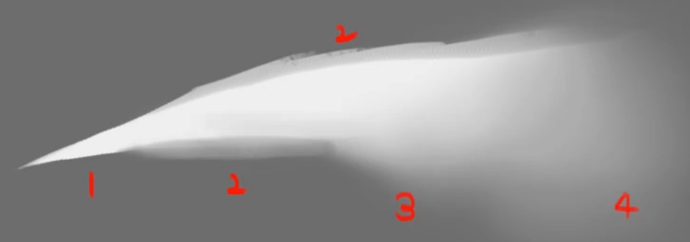

alias:: Edge

- 边缘有四个级别——
	- sharp，最硬的边
	  logseq.order-list-type:: number
	- firm，稍软，如到远处的投影
	  logseq.order-list-type:: number
	- soft，更软，如球体的明暗交界线
	  logseq.order-list-type:: number
	- lost，最软，几乎消失，如阴影中的形状
	  logseq.order-list-type:: number
- 
-
- 绘画时要多关心边缘，边缘错误会导致画面的整个感觉就不一样，容易糊，脏，读者难以找到焦点。
- **边缘错误等于光影、结构错误**。
- 刚开始学习时，可以无视边缘控制，始终使用sharp。
-